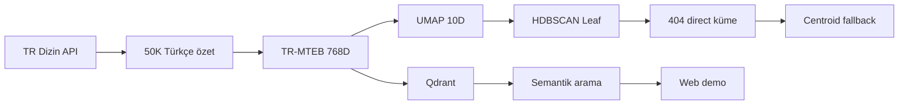
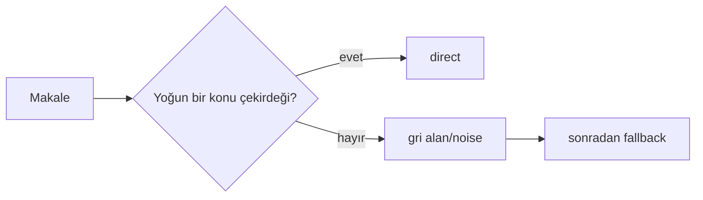
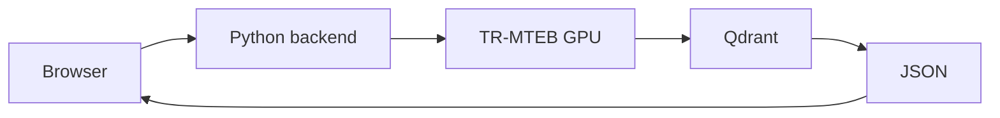

# TR Dizin 50.000 Makale — Deneyler, Gerçek Sonuçlar ve Kararlar

> Ana rapor. Sayılar repository'deki kalıcı CSV/JSON/MD çıktılarından okunmuştur. “Top-1/Top-2”, accuracy değil TR Dizin subject metadata tutarlılığıdır; subject kesin ground truth değildir. Pilot=1.000, validation=5.000, final=50.000 makale.

## Kısa proje hikâyesi



## Deney 1 — Problem ve veri kaynağı
### 1. Neden bu deneyi yaptık?
PDF erişimi, telif ve metin çıkarma hataları yerine denetlenebilir Türkçe metin gerekiyordu.
### 2. Ne denedik?
PDF yaklaşımı ile TR Dizin API'nin yapılandırılmış `abstract_tr` ve metadata alanları karşılaştırıldı.
### 3. Deney düzeni
API'de `PAPER`, Türkçe, 2008–2025, 12 geniş sorgu, 100 kayıt/sayfa ve en çok 30 sayfa; hedef 50K. Bu sorgu-yıl-sayfa örneklemesidir, random sample değildir. Subject embedding girdisi yapılmadı.
### 4. GERÇEK SONUÇLAR
| Ölçü | Sonuç |
|---|---:|
| Satır / benzersiz ID / benzersiz özet | 50.000 / 50.000 / 50.000 |
| Boş başlık / geçersiz özet | 0 / 0 |
| Subject / keyword mevcut | %99,83 / %37,156 |
| Özet karakteri ort./medyan/min–maks | 1.427,1 / 1.356 / 81–5.999 |
| SCIENCE / SOCIAL / BOTH / OTHER | 15.103 / 33.060 / 1.824 / 13 |
### 5. Sonuç nasıl yorumlandı?
API temiz ve aynı şemada özet sağladı; 50K ölçek çeşitlilik ve ürün testi için seçildi, evreni temsil garantisi değildir.
### 6. Ne karar verdik?
PDF yerine API ve yalnız Türkçe abstract; checksumlu 50K final dataset.
### 7. Bu karar sonraki deneye neden yol açtı?
Özetlerin model token sınırına sığıp sığmadığı ölçülmeliydi.
### 8. Kaynak dosyalar
`configs/final_50k.json`, `outputs/final_50k/reports/dataset_quality_summary.json`, `dataset_quality_by_year.csv`.

## Deney 2 — Token uzunluğu ve model input problemi
### 1. Neden bu deneyi yaptık?
Uzun özetlerin kesilmesi model karşılaştırmasını etkileyebilirdi.
### 2. Ne denedik?
Dört tokenizerın kendi maksimum uzunluğunda truncation davranışı.
### 3. Deney düzeni
Day09, aynı 1.000 pilot makale; model tokenizerı, token sayısı, kesilen makale ve kayıp token.
### 4. GERÇEK SONUÇLAR
| Model | Limit | Ort. token | Maks. | Kesilen | Oran | Kayıp token |
|---|---:|---:|---:|---:|---:|---:|
| MiniLM | 128 | 333,05 | 1.180 | 968 | %96,8 | 205.723 |
| TR-MTEB | 512 | 339,98 | 1.109 | 91 | %9,1 | 13.588 |
| E5-large | 512 | 336,05 | 1.183 | 76 | %7,6 | 13.438 |
| GTE multilingual | 8.192 | 333,05 | 1.180 | 0 | %0 | 0 |
### 5. Sonuç nasıl yorumlandı?
MiniLM'in hızı, metnin çoğunu kesme bedeliyle geliyordu. GTE'nin uzun bağlamı yararlıydı ama tek karar ölçütü değildi.
### 6. Ne karar verdik?
Token limiti kalite-hız-bellek karşılaştırmasına dahil edildi.
### 7. Bu karar sonraki deneye neden yol açtı?
Gerçek komşuluk kalitesi ve donanım maliyeti birlikte ölçüldü.
### 8. Kaynak dosyalar
`research/outputs/day09_token_length_summary.csv` ve `.json`.

## Deney 3 — Embedding modeli karşılaştırması
### 1. Neden bu deneyi yaptık?
Türkçe semantik kalite ile hız/bellek arasında dengeli temsil gerekiyordu.
### 2. Ne denedik?
MiniLM, TR-MTEB, E5-large ve GTE multilingual.
### 3. Deney düzeni
Day10: 200 makale, CUDA, batch=4, normalize vektör; Day12: 187 değerlendirilebilir anchor, top-5 subject komşuluğu.
### 4. GERÇEK SONUÇLAR
| Model | Dim | Max token | Top-1 exact | Top-5 exact | Root Top-1 | doc/s | Peak GPU MB |
|---|---:|---:|---:|---:|---:|---:|---:|
| MiniLM | 384 | 128 | %55,08 | %82,89 | %88,77 | 510,50 | 466,23 |
| TR-MTEB | 768 | 512 | %58,82 | %87,70 | **%93,05** | 75,61 | 506,46 |
| E5-large | 1.024 | 512 | **%59,89** | %87,17 | **%93,05** | 23,74 | 2.244,12 |
| GTE multilingual | 768 | 8.192 | %55,61 | **%88,77** | %90,37 | 52,46 | 1.502,68 |


### 5. Sonuç nasıl yorumlandı?
E5 Top-1 exact'te TR-MTEB'den 1,07 puan iyiydi; fakat yaklaşık 3,2× yavaş ve 4,4× peak GPU belleği kullandı. GTE Top-5'te en iyiydi ve kesmedi. TR-MTEB root Top-1'de ortak lider, E5'ten 3,18× hızlı ve 768D idi. Bu nedenle “TR-MTEB her şeyde en iyi” denmedi.
### 6. Ne karar verdik?
Türkçe uygunluğu, kalite, hız, bellek ve depolama dengesiyle TR-MTEB.
### 7. Bu karar sonraki deneye neden yol açtı?
Sabit temsil üzerinde ilk clustering baselineı kuruldu.
### 8. Kaynak dosyalar
`research/outputs/day10_embedding_benchmark.csv`, `day12_subject_neighbor_summary.csv`, `day09_token_length_summary.csv`.

## Deney 4 — KMeans k sweep
### 1. Neden bu deneyi yaptık?
Küme çözünürlüğü için basit, tam kapsamalı baseline gerekiyordu.
### 2. Ne denedik?
`k={5,10,15,20,30,40,50}`.
### 3. Deney düzeni
1.000 TR-MTEB 768D embedding; cosine/euclidean silhouette ve cluster boyutları.
### 4. GERÇEK SONUÇLAR
| k | Cosine sil. | Min | Medyan | Maks | Boyut std |
|---:|---:|---:|---:|---:|---:|
| 5 | 0,07411 | 94 | 188 | 301 | 67,44 |
| 10 | 0,06577 | 48 | 101,5 | 155 | 32,05 |
| 15 | 0,08333 | 29 | 59 | 141 | 33,84 |
| 20 | 0,07575 | 15 | 52 | 92 | 19,74 |
| 30 | **0,09043** | 14 | 33 | 72 | 12,39 |
| 40 | 0,08652 | 3 | 23,5 | 52 | 10,77 |
| 50 | 0,08629 | 4 | 18,5 | 55 | 9,60 |

### 5. Sonuç nasıl yorumlandı?
k=30 sweep'in en yüksek cosine silhouette'ına ve makul çözünürlüğe sahipti; “30 gerçek konu” değildir.
### 6. Ne karar verdik?
KMeans k=30 baseline.
### 7. Bu karar sonraki deneye neden yol açtı?
Zorunlu atamaların gri alanı saklayıp saklamadığı incelendi.
### 8. Kaynak dosyalar
`research/outputs/day14_kmeans_sweep.csv`.

## Deney 5 — Negatif silhouette ve gri alan
### 1. Neden bu deneyi yaptık?
KMeans herkesi bir kümeye atıyordu.
### 2. Ne denedik?
k=30'da makale bazlı silhouette ve negatif örnekler.
### 3. Deney düzeni
1.000 makale; `s=(b-a)/max(a,b)`, cosine uzaklık.
### 4. GERÇEK SONUÇLAR
| Ortalama silhouette | Negatif makale | Toplam |
|---:|---:|---:|
| 0,09043 | **204** | 1.000 |

### 5. Sonuç nasıl yorumlandı?
Negatif değer bozuk makale değil; başka kümeye daha yakın veya disiplinler arası sınır örneği olabilir.
### 6. Ne karar verdik?
Noise bırakabilen HDBSCAN denenecek.
### 7. Bu karar sonraki deneye neden yol açtı?
HDBSCAN parametre taraması yapıldı.
### 8. Kaynak dosyalar
`research/outputs/day14_kmeans_sweep.csv`, `day17_hdbscan_sweep_summary.csv`.

## Deney 6 — HDBSCAN parameter sweep
### 1. Neden bu deneyi yaptık?
Küme sayısını dayatmadan yoğunluk çekirdekleri ve noise bulmak istedik.
### 2. Ne denedik?
EOM/Leaf, farklı `min_cluster_size` ve `min_samples`: H01–H28.
### 3. Deney düzeni
1K TR-MTEB → UMAP10; cluster/noise, cosine silhouette, membership ve 204 negatif KMeans örneğini yakalama.
### 4. GERÇEK SONUÇLAR
| ID | method | mcs | ms | cluster | noise | silhouette | membership | negative capture |
|---|---|---:|---:|---:|---:|---:|---:|---:|
| H01 | EOM | 10 | 5 | 33 | 230 | 0,10683 | 0,85696 | %36,76 |
| H16 | Leaf | 10 | 10 | 30 | 334 | 0,12603 | 0,87321 | %50,49 |
| H18 | Leaf | 15 | 10 | 21 | 398 | **0,13641** | **0,89461** | **%57,35** |

### 5. Sonuç nasıl yorumlandı?
H01 kapsama, H16 denge, H18 silhouette/negative capture adayıydı. Membership konu doğruluğu değildir.
### 6. Ne karar verdik?
H01/H16/H18 kısa liste.
### 7. Bu karar sonraki deneye neden yol açtı?
Yoğunluk seçiminin metadata kalitesi aynı subset üzerinde test edildi.
### 8. Kaynak dosyalar
`research/outputs/day17_hdbscan_sweep_summary.csv`, `day18_hdbscan_candidate_comparison.csv`; tam tablo Appendix B.

## Deney 7 — KMeans vs HDBSCAN metadata kalitesi
### 1. Neden bu deneyi yaptık?
H16'nın yüksek değerleri yalnız kolay makaleleri seçmesinden kaynaklanabilirdi.
### 2. Ne denedik?
KMeans all, H16 direct ve KMeans'in aynı 666 makalelik altkümesi.
### 3. Deney düzeni
1K; weighted subject/root purity, pair overlap ve Jaccard.
### 4. GERÇEK SONUÇLAR
| Yöntem | Kapsama | Subject purity | Root purity | Pair overlap | Jaccard |
|---|---:|---:|---:|---:|---:|
| KMeans all | %100 | 0,5569 | 0,9598 | 0,4464 | 0,1759 |
| H16 direct | %66,6 | **0,6568** | **0,9818** | **0,5754** | **0,2421** |
| KMeans same subset | %66,6 | 0,6254 | 0,9719 | 0,5416 | 0,2206 |
### 5. Sonuç nasıl yorumlandı?
H16 aynı kolay subset KMeans'ini de geçti; fakat %33,4 noise bedeli vardı.
### 6. Ne karar verdik?
HDBSCAN kalite avantajı gerçek ama kapsama ayrı çözülmeli.
### 7. Bu karar sonraki deneye neden yol açtı?
Üç aday ortak karar tablosunda karşılaştırıldı.
### 8. Kaynak dosyalar
`research/outputs/day20_cluster_subject_quality_summary.csv`.

## Deney 8 — H01/H16/H18 karar karşılaştırması
### 1. Neden bu deneyi yaptık?
Silhouette tek başına seçim yapmıyordu.
### 2. Ne denedik?
Coverage, own purity ve aynı-subset KMeans kazanımları.
### 3. Deney düzeni
Day22, 1K; ortak 565 makale ayrıca kontrol edildi.
### 4. GERÇEK SONUÇLAR
| ID | Kapsama | Own purity | KMeans same | Kazanç | Overlap kazancı | Jaccard kazancı |
|---|---:|---:|---:|---:|---:|---:|
| H01 | **%77,0** | 0,6499 | 0,6112 | **+0,0387** | **+0,0610** | **+0,0318** |
| H16 | %66,6 | **0,6568** | 0,6254 | +0,0314 | +0,0338 | +0,0215 |
| H18 | %60,2 | 0,6300 | 0,6408 | −0,0108 | −0,0158 | −0,0025 |
### 5. Sonuç nasıl yorumlandı?
H01 kapsama ve KMeans'e net kazanımda daha dengeliydi; H18'in silhouette üstünlüğü metadata karşılaştırmasına taşınmadı.
### 6. Ne karar verdik?
İlk karar H01/EOM'a döndü; bu karar daha sonra holdout kanıtıyla değişecekti.
### 7. Bu karar sonraki deneye neden yol açtı?
H01 noise makaleleri için tam kapsama yöntemi arandı.
### 8. Kaynak dosyalar
`research/outputs/day22_hdbscan_config_decision.csv`.

## Deney 9 — Noise assignment yöntemi
### 1. Neden bu deneyi yaptık?
230 H01 noise kaydını direct diye göstermeden üründe konuya bağlamak gerekiyordu.
### 2. Ne denedik?
Medoid, centroid, top-5 ve top-10 core mean.
### 3. Deney düzeni
230 noise; metadata Top-1/2, direct H01 recovery ve similarity margin.
### 4. GERÇEK SONUÇLAR
| Yöntem | Noise Top-1 | Noise Top-2 | Recovery | Ort. margin |
|---|---:|---:|---:|---:|
| medoid | 0,2915 | 0,4422 | 0,7688 | 0,03583 |
| centroid | **0,3869** | **0,4774** | **0,9636** | 0,02754 |
| top-5 core | 0,3015 | 0,3618 | 0,7195 | 0,02893 |
| top-10 core | 0,3116 | 0,3920 | 0,7857 | 0,02550 |
### 5. Sonuç nasıl yorumlandı?
Margin confidence olasılığı değildir. Centroid tüm direct üyelerin ortalama yönü olarak üç ana ölçütte kazandı.
### 6. Ne karar verdik?
Centroid fallback; direct/fallback etiketi daima korunacak.
### 7. Bu karar sonraki deneye neden yol açtı?
Tam pilot pipeline ve yeni metin inference'ı kuruldu.
### 8. Kaynak dosyalar
`research/outputs/day24_noise_assignment_method_summary.csv`.

## Deney 10 — H01 final pilot
### 1. Neden bu deneyi yaptık?
H01+centroid'in uçtan uca 1K davranışı görülmeliydi.
### 2. Ne denedik?
Direct HDBSCAN ve centroid fallback birlikte.
### 3. Deney düzeni
1K, 33 küme; 896 metadata etiketli kayıt.
### 4. GERÇEK SONUÇLAR
| Katman | Adet | Top-1 | Top-2 |
|---|---:|---:|---:|
| Genel | 1.000 | 0,5915 | 0,6663 |
| Direct | 770 | 0,6499 | 0,7202 |
| Fallback/noise | 230 | 0,3869 | 0,4774 |
### 5. Sonuç nasıl yorumlandı?
Direct çekirdekler daha tutarlıydı; fallback tam kapsama sağladı ama aynı güven düzeyinde değildi.
### 6. Ne karar verdik?
Atama yöntemi sonuç payloadında açık tutuldu.
### 7. Bu karar sonraki deneye neden yol açtı?
Sistem dışı yeni abstract testi yapıldı.
### 8. Kaynak dosyalar
`research/outputs/day25_h01_centroid_pipeline_summary.json`.

## Deney 11 — Yeni abstract inference
### 1. Neden bu deneyi yaptık?
Pipeline yalnız mevcut satırları değil yeni metni de işlemeliydi.
### 2. Ne denedik?
Turizm geliri–büyüme konulu 678 karakter/148 token yeni özet.
### 3. Deney düzeni
TR-MTEB 768D, HDBSCAN `approximate_predict`, centroid primary/secondary.
### 4. GERÇEK SONUÇLAR
| Status | HDBSCAN p | Primary (sim.) | Secondary (sim.) | Margin |
|---|---:|---|---|---:|
| direct, cluster 0 | 0,6101 | Turizm (0,8843) | İktisat (0,7671) | 0,1172 |
### 5. Sonuç nasıl yorumlandı?
İki ilgili alan çıktı; probability yalnız HDBSCAN üyeliği, margin iki centroid cosine farkıdır.
### 6. Ne karar verdik?
Primary+secondary+margin arayüzü korunacak.
### 7. Bu karar sonraki deneye neden yol açtı?
Güzel tek örnek yerine görülmemiş holdout gerekti.
### 8. Kaynak dosyalar
`research/outputs/day26_new_abstract_result.json`.

## Deney 12 — İlk büyük uyarı: pilot sonucu genellenmedi
### 1. Neden bu deneyi yaptık?
H01 kararının aynı 1K üzerindeki uyumdan ibaret olup olmadığı bilinmiyordu.
### 2. Ne denedik?
Yıl-tabakalı 800 train / 200 test.
### 3. Deney düzeni
Konu adları yalnız train subjectlerinden; test subjectleri yalnız son değerlendirmede.
### 4. GERÇEK SONUÇLAR
| Train | Test | Train cluster | Direct | Fallback | Top-1 | Top-2 |
|---:|---:|---:|---:|---:|---:|---:|
| 800 | 200 | **2** | 200 | 0 | **%7,22** | **%8,89** |
### 5. Sonuç nasıl yorumlandı?
%100 direct başarı değildi: EOM iki dev kümeye collapse olup semantik ayrıntıyı yok etti.
### 6. Ne karar verdik?
H01 final kabul edilmedi; seed ve indirgeme kararlılığı zorunlu oldu.
### 7. Bu karar sonraki deneye neden yol açtı?
Beş seed stability benchmarkı tasarlandı.
### 8. Kaynak dosyalar
`research/outputs/day27_holdout_summary.json`.

## Deney 13 — Stability benchmark
### 1. Neden bu deneyi yaptık?
Tek seed EOM çöküşünü gizlemişti.
### 2. Ne denedik?
UMAP10/PCA50 × EOM/Leaf ve KMeans k30, beş seed.
### 3. Deney düzeni
1K içinde 800/200; cluster mean±std/min–max, collapse, noise ve holdout Top-1/2.
### 4. GERÇEK SONUÇLAR
| Yöntem | Cluster mean±std (min–max) | Collapse | Noise | Top-1 | Top-2 |
|---|---:|---:|---:|---:|---:|
| UMAP10 EOM | 6,8±9,6 (2–26) | 4 | 0,050 | 0,196 | 0,221 |
| UMAP10 Leaf | **30,0±1,67 (27–32)** | **0** | 0,2615 | 0,509 | **0,611** |
| PCA50 EOM | 2,2±0,40 (2–3) | 5 | 0,5228 | 0,154 | 0,166 |
| PCA50 Leaf | 3,8±0,75 (3–5) | 4 | 0,8058 | 0,188 | 0,208 |
| KMeans k30 | 30±0 (30–30) | 0 | 0 | **0,510** | 0,604 |


### 5. Sonuç nasıl yorumlandı?
PCA+HDBSCAN çöktü; EOM seed duyarlıydı. UMAP10+Leaf KMeans'e yakın Top-1, daha iyi Top-2 ve kararlı ayrıntı verdi.
### 6. Ne karar verdik?
UMAP10, Leaf finalist; KMeans baseline.
### 7. Bu karar sonraki deneye neden yol açtı?
Bağımsız 5K corpus üzerinde doğrulama gerekti.
### 8. Kaynak dosyalar
`research/outputs/day28_stability_method_summary.csv`.

## Deney 14 — Bağımsız 5K validation
### 1. Neden bu deneyi yaptık?
Pilot seçimlerinin farklı ID'lere genellenmesi gerekiyordu.
### 2. Ne denedik?
Pilot/final ile ID overlapı olmayan 5K; KMeans k30 vs UMAP10+Leaf.
### 3. Deney düzeni
Beş seed; probe Top-1/2, pairwise ARI/NMI. ARI/NMI iki koşunun üyelik benzerliğini ölçer, konu doğruluğunu değil.
### 4. GERÇEK SONUÇLAR
| Finalist | Cluster | Noise | Top-1 | Top-2 | ARI | NMI |
|---|---:|---:|---:|---:|---:|---:|
| KMeans k30 | 30±0 | 0 | 0,5183 | 0,6297 | 0,5416±0,0244 | 0,7510±0,0118 |
| UMAP10 HDBSCAN Leaf | 96,8±4,4 | 0,3579 | **0,5871** | **0,7045** | **0,6033±0,0235** | **0,8449±0,0089** |

### 5. Sonuç nasıl yorumlandı?
Leaf dört ana ölçütte üstün, collapse=0 idi; noise ürün katmanında fallback gerektiriyordu.
### 6. Ne karar verdik?
Final clustering: UMAP10+HDBSCAN Leaf.
### 7. Bu karar sonraki deneye neden yol açtı?
Sayısal üstünlüğün gerçek başlıklarda anlaşılır olması denetlendi.
### 8. Kaynak dosyalar
`research/outputs/day29_embeddings/tr_mteb_validation_5000.json`, `day30_finalist_summary.csv`, `day30_pairwise_stability.csv`.

## Deney 15 — Interpretability audit
### 1. Neden bu deneyi yaptık?
Metrikler kümelerin insana anlamlı göründüğünü garanti etmez.
### 2. Ne denedik?
Seed 33 clusterları; iyi ve zayıf örneklerde gerçek temsilci başlıklar.
### 3. Deney düzeni
5K probe; direct/fallback, metadata Top-1/2 ve beş temsilci başlık.
### 4. GERÇEK SONUÇLAR
| Örnek | Probe | Direct | Top-1/2 | Temsilci başlık örnekleri |
|---|---:|---:|---:|---|
| Eğitim, c7 | 14 | 11 | 0,643/0,786 | Lise Öğrencilerinin Tarih Dersi ve Bileşenleri ile İlgili Metaforları |
| Onkoloji, c81 | 29 | 13 | 0,517/0,621 | CA-125 and Ceruloplasmin Levels in Ovarian Cancer Patients |
| Psikoloji, c86 | 21 | 11 | 0,667/0,762 | Batı Türkiye'nin Kırsal Bir Kasabasında Kadınlar Arasında Depresyon Sıklığı… |
| Kentsel çalışmalar, c9 | 23 | 15 | **0,304/0,435** | Kentsel Mekanın Değişimi ve Gelişme Döngüleri; Eski Keresteciler Çarşısı… |
| Ziraat mühendisliği, c35 | 20 | 16 | 0,550/0,600 | Farklı Silajlık Mısır Çeşitlerinin Verim ve Bazı Özellikleri… |
| Göz hastalıkları, c0 | 11 | 10 | 0,636/0,818 | Miyopi, katarakt, retinopati |
### 5. Sonuç nasıl yorumlandı?
İyi tematik çekirdeklerin yanında c9 gibi uzman incelemesi isteyen kümeler var; başlıklar konu adlarını denetlemek için vazgeçilmezdir.
### 6. Ne karar verdik?
Cluster adları geçici metadata-derived etiket; uzman onayı gerektirir.
### 7. Bu karar sonraki deneye neden yol açtı?
Seçilen yöntemin 50K ölçek parametreleri tarandı.
### 8. Kaynak dosyalar
`research/outputs/day31_cluster_interpretability_summary.csv`, `day31_cluster_interpretability_report.md`.

## Deney 16 — Final 50K parameter sweep
### 1. Neden bu deneyi yaptık?
5K'da seçilen Leaf için 50K çözünürlük/kapsama dengesi bilinmiyordu.
### 2. Ne denedik?
mcs/ms: 25/5, 25/10, 50/5, 50/10, 100/5, 100/10.
### 3. Deney düzeni
50K TR-MTEB→UMAP10; cluster, noise, silhouette, weighted subject purity ve sampled shared-subject pair.
### 4. GERÇEK SONUÇLAR
| mcs/ms | Cluster | Noise | Silhouette | Weighted purity | Pair shared subject |
|---|---:|---:|---:|---:|---:|
| **25/5** | **404** | 23.347 | 0,07921 | **0,75735** | **0,72767** |
| 25/10 | 366 | 24.336 | 0,08276 | 0,75202 | 0,72658 |
| 50/5 | 239 | 22.185 | 0,06894 | 0,73598 | 0,70472 |
| 50/10 | 222 | 22.497 | 0,08783 | 0,73627 | 0,70271 |
| 100/5 | 111 | **20.010** | 0,08423 | 0,71329 | 0,66245 |
| 100/10 | 109 | 21.594 | **0,10033** | 0,71670 | 0,66145 |

### 5. Sonuç nasıl yorumlandı?
100/10 silhouette lideriydi ama daha kaba ve metadata tutarlılığı düşüktü. 25/5 daha ayrıntılı, en yüksek purity/pair oranlı ve aşırı cluster uyarısızdı.
### 6. Ne karar verdik?
Leaf 25/5; tek metrikle değil çözünürlük+metadata+noise dengesiyle.
### 7. Bu karar sonraki deneye neden yol açtı?
23.347 noise için final fallback ve görsel ayrım üretildi.
### 8. Kaynak dosyalar
`outputs/final_50k/clustering/hdbscan_parameter_sweep.csv`, `final_topic_pipeline_summary.json`.

## Deney 17 — Final direct / fallback
### 1. Neden bu deneyi yaptık?
HDBSCAN doğal olarak tam kapsama sağlamıyordu.
### 2. Ne denedik?
Direct üyelik korunurken noise, en yakın iki normalize direct centroid ile bağlandı.
### 3. Deney düzeni
50K, 404 cluster; primary/secondary cosine ve aralarındaki margin.
### 4. GERÇEK SONUÇLAR
| Direct HDBSCAN | Centroid fallback | Toplam |
|---:|---:|---:|
| **26.653 (%53,306)** | **23.347 (%46,694)** | 50.000 |


### 5. Sonuç nasıl yorumlandı?
Primary en yakın, secondary ikinci centroid; margin farktır, olasılık değildir. Fallback doğal HDBSCAN üyeliği değildir.
### 6. Ne karar verdik?
Tam kapsama sağlandı, `assignment_method` açıkça taşındı.
### 7. Bu karar sonraki deneye neden yol açtı?
2D haritanın doğru ve yanlış çıkarımları belgelendi.
### 8. Kaynak dosyalar
`outputs/final_50k/clustering/final_topic_pipeline_summary.json`, `noise_fallback_assignments.csv`.

## Deney 18 — Final UMAP / cluster map
### 1. Neden bu deneyi yaptık?
404 kümeyi ve boyut dağılımını sunumda görünür kılmak gerekiyordu.
### 2. Ne denedik?
Ayrı UMAP2D cluster haritası, cluster size ve parameter comparison.
### 3. Deney düzeni
2D yalnız görselleştirme; clustering 10D, arama 768D.
### 4. GERÇEK SONUÇLAR

**Burada ne görüyoruz?** Yerel adacıklar. **Hangi sonucu çıkarabiliriz?** Benzer bölgeler ve sınırlar keşif için görülebilir. **ÇIKARAMAYIZ:** Eksenlerin konu adı olduğu veya 2D mesafenin tam 768D anlam uzaklığı olduğu.


**Burada ne görüyoruz?** Direct cluster boyut dağılımı. **Çıkarabiliriz:** Çözünürlük heterojen. **ÇIKARAMAYIZ:** Büyük cluster daha doğru/önemli.


**Burada ne görüyoruz?** Altı ayarın trade-off'u. **Çıkarabiliriz:** Parametre değişince yapı değişir. **ÇIKARAMAYIZ:** Tek en yüksek bar evrensel optimumdur.
### 5. Sonuç nasıl yorumlandı?
2D keşif görselidir, bilimsel kanıtın tek kaynağı değildir.
### 6. Ne karar verdik?
10D clustering ve 2D sunum ayrımı korunacak.
### 7. Bu karar sonraki deneye neden yol açtı?
50K vektörde gerçek zamanlı arama katmanı kuruldu.
### 8. Kaynak dosyalar
`outputs/final_50k/figures/*.png`.

## Deney 19 — Qdrant ürün aşaması
### 1. Neden bu deneyi yaptık?
`.npy` brute force filtre, payload ve servis yaşam döngüsünü yönetmiyordu.
### 2. Ne denedik?
Normalize 768D cosine vektörleri Qdrant collection'a indeksleme.
### 3. Deney düzeni
REST 6335; payload indexleri yıl, database, subject, assignment ve topic alanları.
### 4. GERÇEK SONUÇLAR
| Collection | Point | Vektör | Distance | Metin |
|---|---:|---:|---|---|
| `trdizin_articles_50000` | 50.000 | 768D | Cosine | abstract |
| `trdizin_titles_50000` | 50.000 | 768D | Cosine | title |
| `trdizin_bm25_50000` | 50.000 | sparse | BM25 | title+keyword |
### 5. Sonuç nasıl yorumlandı?
Qdrant yakın komşu araması ve metadata filtresini servisleştirir; bilimsel embeddingi değiştirmez.
### 6. Ne karar verdik?
Ana abstract collection final ürün indeksi.
### 7. Bu karar sonraki deneye neden yol açtı?
Gerçek sorgular ve latency ölçüldü.
### 8. Kaynak dosyalar
`outputs/final_50k/search/qdrant_*_manifest.json`.

## Deney 20 — Semantic search
### 1. Neden bu deneyi yaptık?
Kullanıcının doğal dil sorgusuyla makale bulması gerekiyordu.
### 2. Ne denedik?
TR-MTEB query → normalize 768D → Qdrant cosine.
### 3. Deney düzeni
50K abstract collection; top-10 ve payload metadata.
### 4. GERÇEK SONUÇLAR
| Sorgu | İlk sonuç | Skor | Qdrant süre |
|---|---|---:|---:|
| öğretmenlerin sınıf yönetimi becerileri | Öğretmenlerin Sınıf Yönetimi Becerilerine İlişkin Görüşleri | 0,5968 | 0,00650 s |
| meme kanserinde tanı ve tedavi yöntemleri | Kendi kendine meme muayenesi çelişkisi | kaynak CSV | 0,00490 s |
### 5. Sonuç nasıl yorumlandı?
İki sorguda sonuçlar konuya uyumluydu. Raporlanmış query embedding 0,11–0,18 s; Qdrant sorgu bazında 0,004–0,009 s, fakat embedding süreleri benchmark JSON'unda ayrı alan değildir.
### 6. Ne karar verdik?
Abstract dense ana retrieval.
### 7. Bu karar sonraki deneye neden yol açtı?
Seçilmiş örnek yerine 12 sorguluk benchmark yapıldı.
### 8. Kaynak dosyalar
`retrieval_benchmark_results.csv`, `retrieval_benchmark_summary.json`, `FINAL_SEARCH_AND_QDRANT_REPORT.md`.

## Deney 21 — Retrieval benchmark
### 1. Neden bu deneyi yaptık?
Başarılı iki örnek sistematik performans göstermez.
### 2. Ne denedik?
12 Türkçe sorgu; metadata relevance.
### 3. Deney düzeni
50K, top-10; P@5/P@10/MRR/nDCG. Bunlar insan etiketli accuracy değildir.
### 4. GERÇEK SONUÇLAR
| ID | Sorgu (kısa) | P@5 | P@10 | MRR | nDCG |
|---|---|---:|---:|---:|---:|
| Q01 | sınıf yönetimi | 1 | 1 | 1 | 1 |
| Q02 | meme kanseri | 1 | 1 | 1 | 1 |
| **Q03** | **eğitimde yapay zekâ** | **0,20** | **0,20** | **0,25** | **0,4575** |
| Q04 | enflasyon/büyüme | 1 | 1 | 1 | 1 |
| Q05 | kent/iklim | 1 | 1 | 1 | 1 |
| Q06 | depresyon/kaygı | 1 | 1 | 1 | 1 |
| Q07 | bitki hastalıkları | 1 | 1 | 1 | 1 |
| Q08 | anayasa/insan hakları | 1 | 1 | 1 | 1 |
| Q09 | Osmanlı arşivleri | 1 | 1 | 1 | 1 |
| **Q10** | **Türkçe NLP** | **0** | **0** | **0** | **0** |
| Q11 | kalp damar | 1 | 1 | 1 | 1 |
| Q12 | aşırı turizm | 1 | 1 | 1 | 1 |
| **Ortalama** | 12 sorgu | **0,85** | **0,85** | **0,8542** | **0,8715** |

### 5. Sonuç nasıl yorumlandı?
10 kolay sorgunun kusursuz metadata eşleşmesi ortalamayı yükseltti; Q03/Q10 failure analysis zorunlu oldu.
### 6. Ne karar verdik?
Aggregate tek başına yeterli değil; sorgu bazlı hata analizi.
### 7. Bu karar sonraki deneye neden yol açtı?
Q03 ve Q10 ayrı incelendi.
### 8. Kaynak dosyalar
`outputs/final_50k/search/retrieval_benchmark_summary.json`, `retrieval_benchmark_results.csv`.

## Deney 22 — Failure analysis Q03
### 1. Neden bu deneyi yaptık?
“yapay zekânın eğitimde kullanılması” P@10=0,20 kaldı.
### 2. Ne denedik?
İlk 10 başlık ve metadata relevance elle incelendi.
### 3. Deney düzeni
Abstract dense, rank 1–10.
### 4. GERÇEK SONUÇLAR
| Rank | Rel. | Başlık |
|---:|---:|---|
|1|0|Radyasyon Onkolojisinde Yapay Zeka|
|2|0|YSA tabanlı sistemler için görsel bir arayüz tasarımı|
|3|0|Yapay Zekâ ve Fikri Mülkiyet|
|4|1|DKAB Öğretmenlerinin Eğitimde Yapay Zekâ Kullanımına İlişkin Görüşleri|
|5|0|Çağdaş Zihin Felsefesinde Yapay Zekâ Tartışmaları…|
|6|0|İş İlişkisinin Kurulmasında Robot İşe Alım ve Yapay Zekâ…|
|7|0|Virtual lab: Space vector PWM…|
|8|1|Eğitimde Yapay Zekânın Kullanılması…|
|9|0|AB Yapay Zekâ Tüzüğü'nün İş İlişkileri Üzerindeki Etkileri|
|10|0|Fen Bilimleri Öğretmenlerinin… Yapay Zekâ Kullanma Durumları|
### 5. Sonuç nasıl yorumlandı?
Dense “yapay zekâ” anlamını, eğitim niyetiyle kesişimden daha baskın sıraladı; metadata etiketi rank10'u da 0 saydı.
### 6. Ne karar verdik?
Title sinyali denenmeli.
### 7. Bu karar sonraki deneye neden yol açtı?
Q10'da corpus coverage mı ranking mi ayrıştırıldı.
### 8. Kaynak dosyalar
`outputs/final_50k/search/retrieval_benchmark_results.csv`.

## Deney 23 — Failure analysis Q10
### 1. Neden bu deneyi yaptık?
Türkçe NLP sorgusu tüm metriklerde sıfırdı.
### 2. Ne denedik?
İlk 10 dense sonuç ve corpustaki gerçek NLP başlıkları.
### 3. Deney düzeni
Abstract dense top-10; ayrıca title/keyword taraması raporu.
### 4. GERÇEK SONUÇLAR
| Rank | Rel. | Başlık |
|---:|---:|---|
|1|0|Antalya Kaş Ağzından Derleme Sözlüğü'ne Katkılar|
|2|0|Kamus-i Türki üzerine bir inceleme|
|3|0|Dîvânü Lûgati't Türk'te sözvarlığı…|
|4|0|Türkçe öğretim programlarının değerlendirilmesi|
|5|0|A Turkish Manual karşılaştırmalı inceleme|
|6|0|Anadolu ağızlarında tarımla ilgili kelimeler|
|7|0|Ömer Seyfettin Hikâyelerinde Renkler…|
|8|0|Dîvânü Lügâti't-Türk'te ekler…|
|9|0|Grammaire Turque ve atasözleri|
|10|0|Kültür aktarımında yazılı anlatımın rolü|
### 5. Sonuç nasıl yorumlandı?
Corpus'ta BERT sınıflandırma, duygu analizi ve “Ortak Türk Abecesi…NLP Uygulamaları” vardır; sorun coverage değil dense rankingdir.
### 6. Ne karar verdik?
Teknik terimler için lexical kanal denenecek.
### 7. Bu karar sonraki deneye neden yol açtı?
Önce title dense, sonra BM25 kuruldu.
### 8. Kaynak dosyalar
`retrieval_benchmark_results.csv`, `FINAL_SEARCH_AND_QDRANT_REPORT.md`.

## Deney 24 — Title dense
### 1. Neden bu deneyi yaptık?
Kısa sorgu niyeti başlıkta özete göre daha açık olabilir.
### 2. Ne denedik?
50K `title_tr` için aynı TR-MTEB.
### 3. Deney düzeni
CUDA, batch64, normalize float32 768D.
### 4. GERÇEK SONUÇLAR
| Shape | Süre | GPU | Peak CUDA | Norm |
|---|---:|---|---:|---:|
| (50.000,768) | 58,489 s | cuda:0 | 1.017.881.600 byte | 1,0 |
### 5. Sonuç nasıl yorumlandı?
Q03'ün açık eğitim başlıkları görünür oldu; ortak 12-query ölçüm kaydı yok.
### 6. Ne karar verdik?
Title ayrı dense kanal, final ana yöntem değil.
### 7. Bu karar sonraki deneye neden yol açtı?
Q10 teknik terimleri için lexical eşleşme gerekti.
### 8. Kaynak dosyalar
`tr_mteb_titles_50000_metadata.json`, `qdrant_title_index_manifest.json`.

## Deney 25 — BM25
### 1. Neden bu deneyi yaptık?
Dense Q10'u Türk dili çalışmalarına götürdü; “doğal dil işleme/BERT” exact terimleri kayboldu.
### 2. Ne denedik?
Title+keywords üzerinde Qdrant sparse BM25.
### 3. Deney düzeni
50K, `qdrant/bm25`, multilingual tokenizer.
### 4. GERÇEK SONUÇLAR
| Collection | Point | Alanlar | Model |
|---|---:|---|---|
| `trdizin_bm25_50000` | 50.000 | title_tr + keywords_tr | qdrant/bm25 |
### 5. Sonuç nasıl yorumlandı?
BM25 kelime eşleşmesini; dense anlam yakınlığını taşır. Q10 gerçek teknik makalelerin görünürlüğünü artırdı, fakat kalıcı rank tablosu yok.
### 6. Ne karar verdik?
BM25 tamamlayıcı kanal.
### 7. Bu karar sonraki deneye neden yol açtı?
Üç listenin skor ölçeklerini karıştırmadan birleştirme denendi.
### 8. Kaynak dosyalar
`qdrant_bm25_manifest.json`, `FINAL_SEARCH_AND_QDRANT_REPORT.md`.

## Deney 26 — Three-way RRF
### 1. Neden bu deneyi yaptık?
Abstract anlamı, title niyeti ve BM25 terim sinyali birlikte gerekliydi.
### 2. Ne denedik?
Abstract dense + title dense + BM25, Reciprocal Rank Fusion: `Σ1/(k+rank)`.
### 3. Deney düzeni
Q03/Q10 gözlem; farklı skor ölçekleri yerine rank fusion.
### 4. GERÇEK SONUÇLAR
| Sorgu | Gözlenen değişim | Sayısal ortak benchmark |
|---|---|---|
| Q03 | Eğitim niyetli başlıklar yukarı taşındı | **Yok** |
| Q10 | Gerçek NLP makalesi görünür oldu; ilk 10 bütünüyle çözülmedi | **Yok** |
### 5. Sonuç nasıl yorumlandı?
Q03 için “ne kadar” iyileştiği kalıcı metrikle doğrulanamıyor; sayı uydurulmadı. Q10 kalitatif olarak iyileşti ama problem sürdü.
### 6. Ne karar verdik?
Dense final; hybrid “Experimental”.
### 7. Bu karar sonraki deneye neden yol açtı?
İki mod final demoda ayrı sunuldu.
### 8. Kaynak dosyalar
`scripts/search/13_three_way_hybrid_search.py`, `FINAL_SEARCH_AND_QDRANT_REPORT.md`.

## Deney 27 — Final web demo
### 1. Neden bu deneyi yaptık?
Final sistemi stajyer ve değerlendirici için etkileşimli göstermek gerekiyordu.
### 2. Ne denedik?
Statik browser UI + Python backend; semantic ve Experimental hybrid modları.
### 3. Deney düzeni
Model süreçte bellekte, encode lock; Qdrant 6335; JSON API ve filtreler.
### 4. GERÇEK SONUÇLAR

### 5. Sonuç nasıl yorumlandı?
Bu bir algoritma deneyi değil, seçilmiş artefactları gösteren ürün katmanıdır.
### 6. Ne karar verdik?
Semantic varsayılan; hybrid açıkça Experimental.
### 7. Bu karar sonraki deneye neden yol açtı?
Proje zinciri tamamlandı; bundan sonrası insan etiketli retrieval/reranking çalışmasıdır.
### 8. Kaynak dosyalar
`scripts/demo/14_demo_server.py`, `web/demo/index.html`.

## Son karar matrisi

| Karar noktası | Alternatifler | Gerçek kanıt | Seçilen | Neden |
|---|---|---|---|---|
| Veri kaynağı | PDF/API | kalite özeti, toplama configi | API | yapılandırılmış Türkçe özet, denetlenebilirlik |
| Embedding | MiniLM/E5/GTE/TR-MTEB | Day09/10/12 | TR-MTEB | kalite-hız-bellek-Türkçe dengesi |
| Dim reduction | PCA/UMAP | Day28 | UMAP10 | PCA collapse, Leaf kararlılığı |
| Cluster selection | EOM/Leaf/KMeans | Day27/28/30 | HDBSCAN Leaf | EOM collapse; Leaf Top-1/2 ve ARI/NMI |
| Noise assignment | medoid/centroid/core mean | Day24 | centroid | Top-1/2 ve recovery lideri |
| Final Leaf ayarı | 25/5…100/10 | 50K sweep | 25/5 | çözünürlük+purity+pair/noise dengesi |
| Arama uzayı | UMAP/orijinal | mimari ve manifest | 768D orijinal | indirgeme kaybı yok |
| Depolama | `.npy` brute force/Qdrant | 50K manifestler | Qdrant | ANN servis ve payload filtre |
| Search | dense/hybrid | benchmark+Q03/Q10 | dense final, hybrid experimental | hybrid ortak nicel benchmarkı yok |

## Appendix A — Önemli output dizini

Day09, 10, 12, 14, 17, 18, 20, 22, 24, 25–31 çıktıları `outputs/`; final kalite/embedding/clustering/search manifest ve tabloları `outputs/final_50k/` altındadır. Her deneyde kullanılan kesin yol yukarıda verilmiştir.

## Appendix B — H01–H28 tam tablo

Tam ve kayıpsız kaynak: `research/outputs/day17_hdbscan_sweep_summary.csv`. Bu appendix aşağıda repository verisinden mekanik olarak üretilmiştir.

| ID | method | mcs | ms | cluster | noise | noise % | silhouette | membership | negative capture |
|---|---|---:|---:|---:|---:|---:|---:|---:|---:|
| H01 | eom | 10 | 5 | 33 | 230 | 23.0 | 0.10683 | 0.85696 | 36.76% |
| H02 | eom | 10 | 10 | 2 | 0 | 0.0 | -0.06502 | 0.98216 | 0.00% |
| H03 | eom | 15 | 5 | 2 | 0 | 0.0 | -0.06502 | 0.99100 | 0.00% |
| H04 | eom | 15 | 10 | 2 | 0 | 0.0 | -0.06502 | 0.98490 | 0.00% |
| H05 | eom | 15 | 15 | 2 | 0 | 0.0 | -0.06502 | 0.97438 | 0.00% |
| H06 | eom | 20 | 5 | 2 | 0 | 0.0 | -0.06502 | 0.99324 | 0.00% |
| H07 | eom | 20 | 10 | 2 | 0 | 0.0 | -0.06502 | 0.98634 | 0.00% |
| H08 | eom | 20 | 15 | 2 | 0 | 0.0 | -0.06502 | 0.97575 | 0.00% |
| H09 | eom | 30 | 5 | 4 | 92 | 9.2 | -0.03611 | 0.98389 | 11.76% |
| H10 | eom | 30 | 10 | 2 | 105 | 10.5 | 0.20072 | 0.98089 | 15.69% |
| H11 | eom | 30 | 15 | 4 | 198 | 19.8 | 0.00967 | 0.97722 | 26.96% |
| H12 | eom | 40 | 5 | 3 | 89 | 8.9 | 0.01302 | 0.98678 | 11.76% |
| H13 | eom | 40 | 10 | 2 | 105 | 10.5 | 0.20072 | 0.98898 | 15.69% |
| H14 | eom | 40 | 15 | 4 | 198 | 19.8 | 0.00967 | 0.98929 | 26.96% |
| H15 | leaf | 10 | 5 | 34 | 234 | 23.4 | 0.10592 | 0.85603 | 37.25% |
| H16 | leaf | 10 | 10 | 30 | 334 | 33.4 | 0.12603 | 0.87321 | 50.49% |
| H17 | leaf | 15 | 5 | 25 | 212 | 21.2 | 0.08532 | 0.89037 | 33.33% |
| H18 | leaf | 15 | 10 | 21 | 398 | 39.8 | 0.13641 | 0.89461 | 57.35% |
| H19 | leaf | 15 | 15 | 17 | 477 | 47.7 | 0.15463 | 0.91424 | 68.14% |
| H20 | leaf | 20 | 5 | 22 | 196 | 19.6 | 0.08354 | 0.91462 | 30.39% |
| H21 | leaf | 20 | 10 | 16 | 411 | 41.1 | 0.12173 | 0.91711 | 57.35% |
| H22 | leaf | 20 | 15 | 17 | 477 | 47.7 | 0.15463 | 0.95252 | 68.14% |
| H23 | leaf | 30 | 5 | 14 | 351 | 35.1 | 0.09739 | 0.96834 | 42.16% |
| H24 | leaf | 30 | 10 | 11 | 358 | 35.8 | 0.08553 | 0.93723 | 45.10% |
| H25 | leaf | 30 | 15 | 9 | 367 | 36.7 | 0.08672 | 0.92526 | 48.53% |
| H26 | leaf | 40 | 5 | 10 | 298 | 29.8 | 0.07072 | 0.96663 | 35.78% |
| H27 | leaf | 40 | 10 | 8 | 378 | 37.8 | 0.09115 | 0.96245 | 46.08% |
| H28 | leaf | 40 | 15 | 8 | 358 | 35.8 | 0.09787 | 0.97476 | 48.04% |

## Appendix C — 12 retrieval sorgusu tam tablo

Tam tablo Deney 21'dedir; rank bazlı 120 satır `outputs/final_50k/search/retrieval_benchmark_results.csv` içindedir.

## Appendix D — Final repository yapısı

```text
src/trdizin_topic_pipeline/     reusable package
research/experiments/01_problem_and_data/ ... research/experiments/06_stability_and_validation/
scripts/pipeline/  scripts/search/  scripts/demo/
docs/  configs/  data/  outputs/  web/  infra/
```

## Appendix E — Final çalıştırma komutları

```bash
.venv/bin/python scripts/pipeline/01_collect_articles.py --help
.venv/bin/python scripts/pipeline/02_validate_dataset.py --help
.venv/bin/python scripts/pipeline/03_build_embeddings.py --help
.venv/bin/python scripts/pipeline/04_discover_topics.py --help
.venv/bin/python scripts/pipeline/05_build_final_report.py --help
.venv/bin/python scripts/search/07_semantic_search.py --help
.venv/bin/python scripts/demo/14_demo_server.py --help
```

## Appendix F — Mini sözlük

| Terim | Bu projedeki anlamı |
|---|---|
| Embedding | abstract/title metninin normalize sayı vektörü |
| Cosine | vektör yön benzerliği; olasılık değil |
| Silhouette | küme içi/dışı ayrım ölçüsü; tek seçim kriteri değil |
| UMAP | clustering için 10D, görsel için ayrı 2D indirgeme |
| HDBSCAN Leaf | yoğunluğun ince yaprak kümelerini seçen yöntem |
| Noise | direct yoğunluk kümesine girmeyen kayıt; değersiz veri değil |
| Centroid fallback | noise kaydını en yakın direct küme ortalamasına bağlama |
| ARI/NMI | seedler arası üyelik yapısı benzerliği |
| BM25 | terim tabanlı lexical sıralama |
| RRF | listeleri rank üzerinden birleştirme |

## Doğrulanamayan bilgiler

Hybrid için ortak 12-sorgu metrik/rank çıktısı, Q03'ün nicel iyileşme miktarı, BM25 smoke testinin kesin top-10'u ve query embedding süresinin sorgu bazlı ham kaydı repository'de yoktur. Bunlar bilimsel sonuç gibi sunulmamıştır.
