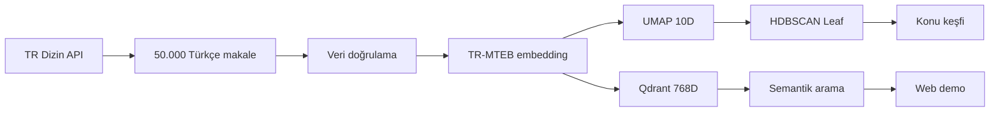
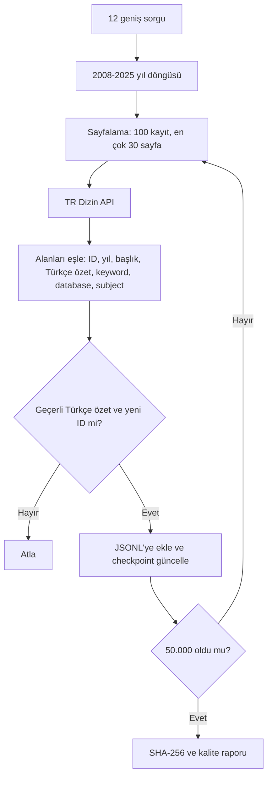
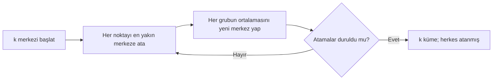
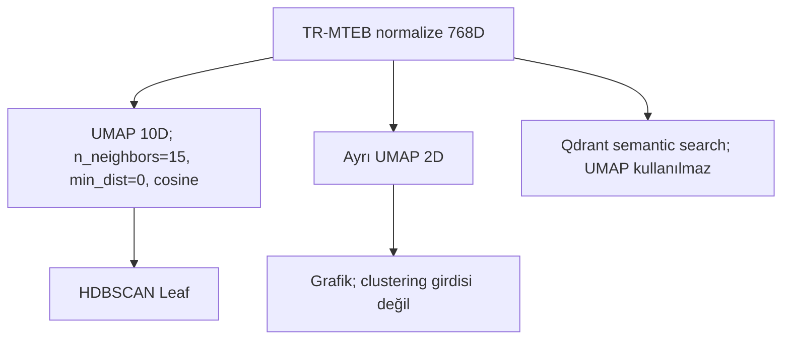
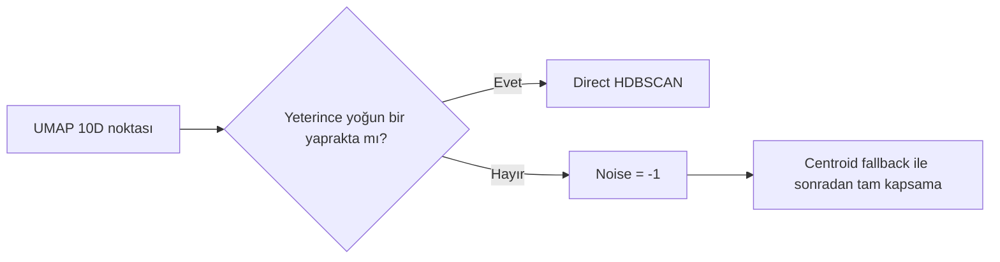
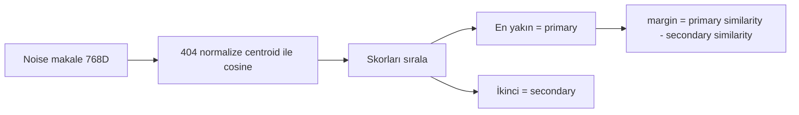
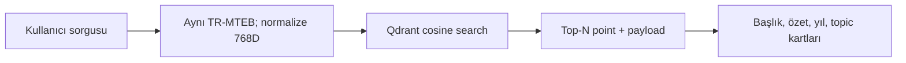
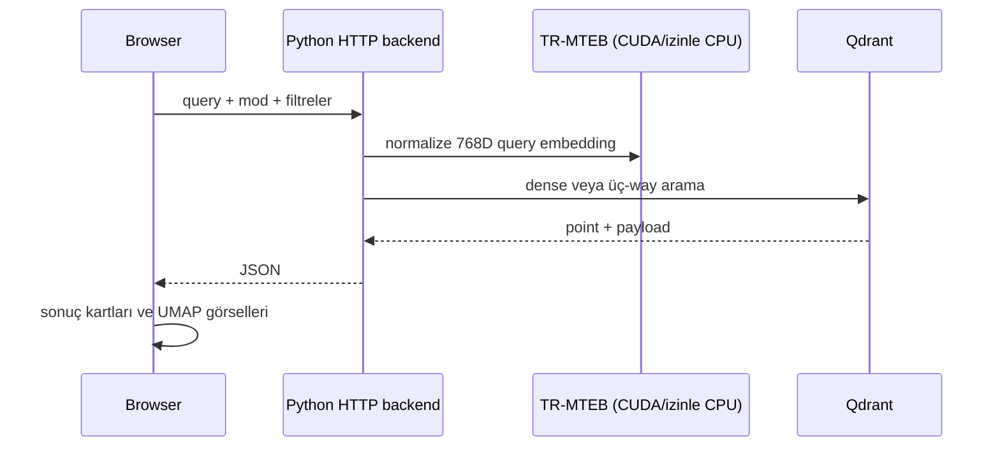
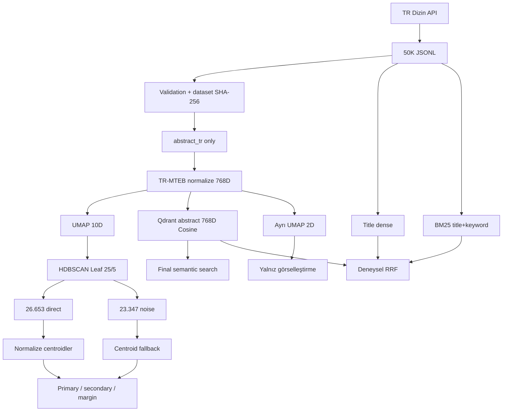

# TR Dizin 50.000 Makale: Kapsamlı Final Proje Raporu

> **Okuma notu.** Bu rapor repository'nin 7 Ağustos 2026 tarihindeki kodu ve kalıcı çıktıları esas alınarak hazırlanmıştır. “Pilot” 1.000, “validation” 5.000 ve “final” 50.000 makaleyi ifade eder. Bir sonuç yalnız kendi deney ölçeğinde yorumlanır. Subject alanı hiçbir aşamada embedding girdisi veya kesin ground truth değildir.

## 1. Yönetici özeti

Bu projenin amacı, TR Dizin'deki en az 50.000 Türkçe akademik makaleyi hazır bir dil modeliyle sayısal olarak temsil etmek, benzer yayın gruplarını etiketsiz biçimde keşfetmek ve doğal dille aramaktır. PDF indirmek veya yeni bir model eğitmek yerine API'nin sağladığı Türkçe özetler kullanılmıştır. Böylece telif, PDF ayrıştırma ve tam metin erişim sorunlarından kaçınılmış; aynı biçimdeki metadata ile tekrarlanabilir bir veri hattı kurulmuştur.



| Final bulgu | Doğrulanmış değer | Kaynak |
|---|---:|---|
| Veri seti | 50.000 satır; 50.000 benzersiz ID ve özet | `outputs/final_50k/reports/dataset_quality_summary.json` |
| Temsil | normalize TR-MTEB, `(50000, 768)` | `outputs/final_50k/embeddings/tr_mteb_50000_metadata.json` |
| Kümeleme | UMAP 10D + HDBSCAN Leaf, mcs=25, ms=5 | `outputs/final_50k/clustering/final_topic_pipeline_summary.json` |
| Keşfedilen küme | 404 | aynı kaynak |
| Doğrudan / fallback | 26.653 / 23.347 | aynı kaynak |
| Ana arama indeksi | 50.000 nokta, 768D, Cosine | `outputs/final_50k/search/qdrant_index_manifest.json` |
| 12 sorguluk keşifsel benchmark | P@5=0,85; P@10=0,85; MRR@10=0,8542; nDCG@10=0,8715 | `outputs/final_50k/search/retrieval_benchmark_summary.json` |

404 sayısı “evrende 404 bilim konusu vardır” demek değildir. Bu veri, temsil, UMAP ve parametreler altında oluşan yoğunluk bölgelerinin sayısıdır. Benzer biçimde arama skoru ve konu marjı olasılık değildir.

## 2. Problem tanımı ve amaç

İstenen sistem beş işi birlikte yapmalıdır: en az 50.000 yayın toplamak; etiketsiz konu kümeleri bulmak; kümeleri 2B görselleştirmek; kümeler arası geçiş/örtüşme alanlarını incelemek; doğal dil sorgusuyla semantik arama yapmak. Hazır embedding modeli kullanılacak, yeni model eğitilmeyecektir.

**Clustering**, “veri kendi içinde hangi gruplara ayrılıyor?” sorusuna; **semantic search**, “bu sorguya anlamca en yakın yayınlar hangileri?” sorusuna cevap verir. Arama için bir makalenin clusterı aynı olmak zorunda değildir; kümeleme de sorgu beklemez. İkisi aynı 768D temsili paylaşsa da farklı görevlerdir.

## 3. Temel kavramlar

| Kavram | Sade açıklama ve küçük örnek |
|---|---|
| API / endpoint | API, iki yazılımın konuşma sözleşmesidir; endpoint belirli kapıdır. Projede yayın arama kapısı `.../api/defaultSearch/publication/`dır. |
| JSON / JSONL | JSON anahtar-değerli veri biçimidir. JSONL'de her satır bağımsız JSON kaydıdır; 50K dosyada her satır bir makaledir. |
| Metadata | Veriyi anlatan veridir: yıl, başlık, subject gibi. Makalenin bilimsel metniyle aynı şey değildir. |
| Abstract | Çalışmanın amaç, yöntem, bulgu ve sonucunu özetleyen metin. Burada Türkçe özet `abstract_tr` kullanılır. |
| Embedding | Metni anlam yakınlıklarını korumaya çalışan sayı listesine çeviren hazır model çıktısıdır. Haritadaki koordinat benzetmesi kullanılabilir. |
| Vektör / uzay | Vektör sıralı sayılar listesidir; vektör uzayı bu listelerin bulunduğu koordinat sistemidir. |
| Boyut | Listedeki koordinat sayısıdır. 768 boyut, makale başına 768 adet float demektir; “768 konu” demek değildir. |
| Normalizasyon | Vektör uzunluğunu 1 yapar. Böylece yön/anlam benzerliği karşılaştırması daha tutarlı olur. |
| Cosine similarity | İki vektör arasındaki açının kosinüsüdür: aynı yön 1'e, dik yön 0'a yakındır. Normalize vektörlerde nokta çarpımıyla hesaplanır. |
| Classification | Önceden tanımlı etiketlerden birini öğretimli olarak tahmin eder; “bu e-posta spam mi?” gibi. |
| Clustering | Etiket verilmeden benzer örnekleri keşfeder; masadaki karışık düğmeleri şekil ve renge göre gruplayan kişi gibi. |
| Supervised / unsupervised | Öğretimli yöntemde hedef etiket vardır; etiketsizde veri yapısı keşfedilir. Bu clustering etiketsizdir. |
| Centroid | Bir kümedeki normalize vektörlerin ortalama yönüdür; grubun sayısal “merkezi”dir. Gerçek bir makale olmak zorunda değildir. |
| Noise | HDBSCAN'in yeterince yoğun bir bölgeye doğrudan bağlamadığı `-1` kayıt. Bozuk veya değersiz veri anlamına gelmez. |
| Boyut indirgeme | Çok koordinatı daha az koordinatla yaklaşık temsil etmedir. Haritayı küçültmek gibi, bilgi kaybı olabilir. |
| PCA | Varyansı doğrusal eksenlerle korumaya çalışan indirgeme. |
| UMAP | Yerel komşulukları doğrusal olmayan biçimde korumaya çalışan indirgeme. |
| KMeans | Kullanıcının verdiği k merkez etrafında tüm noktaları zorunlu olarak gruplar. |
| HDBSCAN | Farklı yoğunluklardaki kalıcı bölgeleri bulur ve bazı noktaları noise bırakabilir. |
| Vector database / Qdrant | Vektörleri yakınlıkla arayan veritabanı. Qdrant ayrıca yıl/database gibi payload filtreleri uygular. |
| BM25 | Sorgu kelimelerinin belgede ayırt edici görülme gücüne dayalı sparse lexical sıralama. Teknik terimleri yakalamada yararlıdır. |
| RRF | Farklı arama listelerinin skor ölçeklerini karıştırmadan sıralarını birleştirir. |
| Holdout | Model/karar kurulurken kullanılmayan, sonradan değerlendirmeye ayrılan veri. |
| Seed | Rastgele başlayan işlemi tekrarlanabilir kılan başlangıç sayısı. |
| Stability | Seed veya örnek değişince üyelik yapısının ne kadar korunduğu. |
| Ground truth | Doğru kabul edilen bağımsız referans etiket. TR Dizin subjectleri bu projede yardımcı metadata, kesin gerçek değildir. |
| Data leakage | Test bilgisinin eğitim/isimlendirme kararına sızması. Holdout subjectleri yalnız son değerlendirmede kullanılmıştır. |

## 4. Veri toplama

`scripts/pipeline/01_collect_articles.py`, `configs/final_50k.json`, `dataset.py` ve `api_client.py` birlikte çalışır. API; `PAPER`, Türkçe yayın dili, 2008–2025 yılları, 12 geniş sorgu, sorgu başına 30 sayfa ve sayfa başına 100 kayıt düzeniyle taranır. İstekler 0,35 saniye aralıklı; connect/read timeoutları 15/75 saniye; retry sayısı 5'tir. Bu düzen **rastgele örnekleme değildir**: sorgu-yıl-sayfa sırası API'nin döndürdüğü kayıtları belirler.

PDF indirilmedi; çünkü ihtiyaç duyulan Türkçe özet ve metadata API'de yapılandırılmış biçimde vardır. PDF; erişim/telif, indirme maliyeti, taranmış sayfa ve metin çıkarma hataları getirirdi. Bu tercih full-text avantajından vazgeçme karşılığında temiz ve denetlenebilir veri sağlar.



Yalnız `abstract_tr` embeddinge girer. Başlık, keyword, subject, yıl ve database küme anlamını sonradan incelemek/filtrelemek içindir. Böylece subjecti girdiye verip sonra subject tutarlılığıyla değerlendirme şeklindeki dairesel leakage önlenir. ID tekrarları ve özet SHA-256 tekrarları kontrol edilir. Boşluk, `-`, `--`, `T.Öz Yok` benzeri placeholder değerler gerçek semantik metin taşımadığı için geçersizdir. Final veri dosyasının SHA-256 değeri `41cf1ec4c7727a983e77f22e9e4db33d0fac51581a20e4c122cc76cc74327257`dir.

Kaynaklar: `scripts/pipeline/01_collect_articles.py`, `configs/final_50k.json`, `src/trdizin_topic_pipeline/dataset.py`, `src/trdizin_topic_pipeline/api_client.py`, `data/state/final_50k_checkpoint.json`.

## 5. Final 50.000 veri seti kalitesi

| Ölçü | Sonuç |
|---|---:|
| Satır / benzersiz article_id / benzersiz özet hash'i | 50.000 / 50.000 / 50.000 |
| Boş başlık / boş veya geçersiz özet | 0 / 0 |
| Subject mevcut | 49.915 (%99,83) |
| Keyword mevcut | 18.578 (%37,156) |
| Özet karakteri ortalama / medyan / min–maks | 1.427,1 / 1.356 / 81–5.999 |
| Token ortalama / medyan / p95 / maks | 335,23 / 315 / 559 / 2.244 |
| 512 token üstü | 3.839 (%7,678) |
| Yalnız SCIENCE / yalnız SOCIAL / BOTH / OTHER | 15.103 / 33.060 / 1.824 / 13 |

`database_distribution` çok-değerli alanı saydığı için SCIENCE 16.927 + SOCIAL 34.884 = 51.811 olur; bu satır sayısı değildir. Ayrık tablo olan `science_social_distribution` 50.000'e toplamlanır.

| Yıl | Adet | Yıl | Adet | Yıl | Adet |
|---:|---:|---:|---:|---:|---:|
| 2008 | 1.732 | 2014 | 552 | 2020 | 4.162 |
| 2009 | 2.067 | 2015 | 1.924 | 2021 | 4.216 |
| 2010 | 2.033 | 2016 | 2.829 | 2022 | 3.612 |
| 2011 | 3.132 | 2017 | 2.032 | 2023 | 4.106 |
| 2012 | 2.128 | 2018 | 2.685 | 2024 | 4.223 |
| 2013 | 1.148 | 2019 | 4.148 | 2025 | 3.271 |


Şekil karakter uzunluklarının dağılımını gösterir; içerik kalitesini veya doğruluğu göstermez. Sunumda “çoğu özet benzer büyüklükte, uç değerler doğrulandı” denebilir. Yanlış yorum: “uzun özet daha kaliteli.”


Şekil model tokenizerına göre uzunluğu gösterir. 512 üstündeki %7,678 kayıt son kısımdan kesilebilir; bu kayıtlar silinmemiştir. Yanlış yorum: “512 karakter”; sınır karakter değil tokendır.

Kaynak: `outputs/final_50k/reports/dataset_quality_summary.json`, `dataset_quality_by_year.csv`, `dataset_quality_report.md`.

## 6. Embedding: metinden 768 sayıya


50.000 satır ve satır başına 768 sayı, `(50000, 768)` matrisidir. Satır JSONL'deki makaleyle aynı sıradadır; sütunlar tek başına adlandırılmış konular değildir. Cosine benzerliği

`cos(a,b) = (a·b) / (||a|| ||b||)`

ile yön yakınlığını ölçer. İki tarif aynı malzemeleri farklı miktarda kullansa bile yönleri yakın olabilir. Normalize vektörlerde uzunluk 1 olduğundan hesap sadeleşir. Final dosya float32, normalize ve CUDA üzerinde RTX 4050 Laptop GPU ile üretilmiştir.

## 7. Embedding modeli seçimi

Day10 hız testi 200 makale; Day12 komşuluk testi 187 değerlendirilebilir anchor üzerindedir. Bu sayılar final 50K performansı değildir.

| Model | Boyut / limit | Top-1 exact | Top-5 any exact | Root top-1 | belge/sn | peak GPU MB | Değerlendirme |
|---|---:|---:|---:|---:|---:|---:|---|
| MiniLM | 384 / 128 | %55,08 | %82,89 | %88,77 | 510,50 | 466,23 | Çok hızlı/hafif; pilotta %96,8 truncation |
| TR-MTEB | 768 / 512 | %58,82 | %87,70 | %93,05 | 75,61 | 506,46 | Türkçe odaklı, dengeli |
| E5-large | 1024 / 512 | **%59,89** | %87,17 | %93,05 | 23,74 | 2.244,12 | Top-1 az daha yüksek; ağır/yavaş |
| GTE multilingual | 768 / 8192 | %55,61 | **%88,77** | %90,37 | 52,46 | 1.502,68 | Kesme yok; daha fazla bellek |

TR-MTEB her sütunda birinci değildir. Seçim kalite, hız, yaklaşık 506 MB pilot peak bellek, 768D depolama ve Türkçe uygunluğu dengesiyle yapılmıştır. “Top-1 exact” gerçek doğruluk değil, komşunun subject metadata ile tutarlılığıdır. Kaynaklar: `research/outputs/day10_embedding_benchmark.csv`, `research/outputs/day12_subject_neighbor_summary.csv`, `research/outputs/day09_token_length_summary.csv`.

## 8. İlk clustering deneyi: KMeans



KMeans'te k kullanıcıdan gelir ve her nokta bir kümeye zorlanır. Pilot sweep'te TR-MTEB cosine silhouette: k=5 `0,0741`, 10 `0,0658`, 15 `0,0833`, 20 `0,0758`, 30 `0,09043`, 40 `0,08652`, 50 `0,08629` oldu. k=30 aday küme çözünürlüğü ve en yüksek sweep silhouette'ı nedeniyle baseline seçildi. “Gerçekte 30 bilim konusu var” sonucu çıkarılamaz.

Kaynak: `research/outputs/day14_kmeans_sweep.csv`.

## 9. Silhouette ve grey-area motivasyonu

Bir makale için `a` kendi kümesine ortalama uzaklık, `b` en yakın diğer kümeye ortalama uzaklık olsun: `s=(b-a)/max(a,b)`. +1'e yakın değer iyi ayrım; 0 sınır; negatif değer makalenin başka kümeye ortalamada daha yakın olduğunu söyler. Negatif makale yanlış/bozuk demek değildir; disiplinler arası çalışma veya zorunlu KMeans ataması olabilir.

Pilot k=30 ortalama cosine silhouette `0,09043`; 204/1.000 makalenin silhouette'ı negatiftir. Bu, tüm noktaları zorlayan KMeans'in tek başına gri alanı ifade etmekte yetersiz kalabileceğini gösterdi ve noise bırakabilen HDBSCAN'i motive etti. Kaynak: `research/outputs/day14_kmeans_sweep.csv`, `research/outputs/day17_hdbscan_sweep_summary.csv`.

## 10. UMAP ve PCA

| Özellik | PCA | UMAP |
|---|---|---|
| Yapı | Doğrusal | Doğrusal olmayan manifold yaklaşımı |
| Öncelik | Küresel varyans | Yerel komşuluk |
| Tekrarlanabilirlik | Genellikle deterministik | Seed duyarlı |
| Bu projedeki rol | 50D stability karşılaştırması | 10D clustering, ayrı 2D görsel |



10D, yerel yapıyı korurken yoğunluk algoritmasını uygulanabilir kılan pilot/stability ile doğrulanmış ara uzaydır. 2D daha çok bilgi kaybeder ve yalnız görsel içindir. UMAP eksen 1/2'nin “sağlık/sosyal” gibi doğrudan anlamı yoktur. Aramada kayıp yaratmamak için orijinal normalize 768D kullanılır.

## 11. HDBSCAN

Kalabalık bir meydanda insan topluluklarını düşünün: yakın ve yoğun duran gruplar cluster, gruplar arasında tek başına duranlar noise olabilir. HDBSCAN farklı yoğunluk seviyelerinde kalıcı grupları seçer.

- `min_cluster_size`: bir grubun küme sayılması için asgari büyüklük.
- `min_samples`: çekirdek yoğunluk şartının katılığı; artınca çoğu zaman noise artar.
- EOM: hiyerarşide daha kalıcı/geniş kümeleri seçer; bazı deneylerde dev kümelere çöktü.
- Leaf: ağacın daha ince yaprak kümelerini seçer; bu projede daha kararlı çözünürlük verdi.

| KMeans | HDBSCAN |
|---|---|
| k önceden verilir | küme sayısı yoğunluktan çıkar |
| herkes atanır | `-1` noise bırakabilir |
| küresel merkezlere dayanır | yoğunluk/hiyerarşiye dayanır |
| daha düzenli, baseline | düzensiz şekil ve geçiş alanına uygun |



## 12. HDBSCAN parameter sweep: 1K pilot

Day17'de H01–H28 tarandı. Üç aday:

| Config | Yöntem | mcs/ms | Küme | Noise | Cosine silhouette | Ort. membership | KMeans negatif capture |
|---|---|---:|---:|---:|---:|---:|---:|
| H01 | EOM | 10/5 | 33 | 230 (%23,0) | 0,10683 | 0,85696 | 75/204 (%36,76) |
| H16 | Leaf | 10/10 | 30 | 334 (%33,4) | 0,12603 | 0,87321 | 103/204 (%50,49) |
| H18 | Leaf | 15/10 | 21 | 398 (%39,8) | **0,13641** | **0,89461** | 117/204 (%57,35) |

Yüksek silhouette tek hedef değildir: H18 daha çok noise ve daha az kapsama getirir. Membership HDBSCAN'in kendi yerel üyelik gücüdür; konu doğruluğu değildir. Kaynak: `research/outputs/day17_hdbscan_sweep_summary.csv`, `research/outputs/day18_hdbscan_candidate_comparison.csv`.

## 13. Subject metadata ile kalite

**Subject purity**, kümede en sık subjectin etiketli üyelere oranıdır; weighted sürüm büyük kümeleri ağırlıklandırır. **Root purity**, Fen/Sosyal gibi kök düzeyindeki karşılığıdır. **Shared subject**, iki makalenin en az bir subject paylaşması; **Jaccard**, kesişim/birleşim oranıdır.

| Değerlendirme (1K pilot) | Kapsama | Weighted subject purity | Root purity | Pair overlap | Jaccard |
|---|---:|---:|---:|---:|---:|
| KMeans, tüm veri | %100 | 0,5569 | 0,9598 | 0,4464 | 0,1759 |
| H16 direct | %66,6 | 0,6568 | 0,9818 | 0,5754 | 0,2421 |
| KMeans, aynı H16 altkümesi | %66,6 | 0,6254 | 0,9719 | 0,5416 | 0,2206 |

Subjectler dergi indeksleme amaçlı, çok etiketli ve farklı ayrıntı düzeyindedir. Bu nedenle değerlendirme sinyali sağlar, ground truth değildir. Kaynak: `research/outputs/day20_cluster_subject_quality_summary.csv`.

## 14. H01/H16/H18 kararının evrimi

İlk sweep'te H18 silhouette/noise yakalama yönünden güçlüydü; H16 daha dengeli çözünürlük sundu. Day22 aynı altküme karşılaştırması H01'in kapsama (%77) ve subject göstergelerinde güçlü olduğunu gösterdi: own purity H01 `0,6499`, H16 `0,6568`, H18 `0,6300`; H01'in KMeans'e purity kazancı `+0,0387` ile en yüksekti. Bu yüzden H01 centroid pipeline bir ara ana aday oldu. Ancak Day27 tek holdoutta H01/EOM iki kümeye çöktü. Day28 çok-seed testi EOM kararsızlığını gösterince karar Leaf lehine revize edildi. Bu çelişki değil; yeni testle hipotezin güncellenmesidir.

## 15. Centroid fallback deneyleri

| Temsil | Noise Top-1 | Noise Top-2 | H01 recovery | Ortalama marj |
|---|---:|---:|---:|---:|
| Tek medoid | 0,2915 | 0,4422 | 0,7688 | 0,03583 |
| Normalize centroid | **0,3869** | **0,4774** | **0,9636** | 0,02754 |
| Top-5 core average | 0,3015 | 0,3618 | 0,7195 | 0,02893 |
| Top-10 core average | 0,3116 | 0,3920 | 0,7857 | **0,02550** |

Centroid, tüm direct üyelerin ortalama yönünü temsil ettiği ve H01 atamalarını en iyi geri ürettiği için seçildi. Düşük marjın kendisi hata değildir; yakın iki konu olabilir. Kaynak: `research/outputs/day24_noise_assignment_method_summary.csv`.

## 16. Holdout problemi

Day27'de yıl tabakalı 800 train / 200 test ayrımı yapıldı. Eğitim subjectleri isimlendirmede, test subjectleri yalnız değerlendirmede kullanıldı. EOM yapılandırması train üzerinde **2 kümeye collapse** oldu; 200 testin tümü direct görünse de Top-1 `0,07222`, Top-2 `0,08889` kaldı. “Herkesi direct atadı” tek başına başarı değildir: iki dev grup semantik ayrıntıyı yok etmiştir. Tek güzel pilot seedine güvenmemenin somut nedeni budur. Kaynak: `research/outputs/day27_holdout_summary.json`.

## 17. Stability benchmark: 1K, beş seed

| Yöntem | Küme ort±std (min–maks) | Collapse | Noise ort±std | Top-1 ort±std | Top-2 ort±std |
|---|---:|---:|---:|---:|---:|
| UMAP10 HDBSCAN EOM | 6,8±9,6 (2–26) | 4 | 0,050±0,100 | 0,196±0,174 | 0,221±0,192 |
| UMAP10 HDBSCAN Leaf | 30,0±1,67 (27–32) | 0 | 0,2615±0,0350 | 0,509±0,007 | 0,611±0,013 |
| PCA50 HDBSCAN EOM | 2,2±0,40 (2–3) | 5 | 0,5228±0,0646 | 0,154±0,040 | 0,166±0,044 |
| PCA50 HDBSCAN Leaf | 3,8±0,75 (3–5) | 4 | 0,8058±0,1237 | 0,188±0,044 | 0,208±0,051 |
| KMeans k30 | 30±0 | 0 | 0 | 0,510±0,038 | 0,604±0,025 |

Collapse, yöntemin beklenen ayrıntı yerine birkaç aşırı büyük kümeye düşmesidir. Leaf'in seedler arasında küme sayısı ve holdout metadata tutarlılığı daha kararlıydı. Kaynak: `research/outputs/day28_stability_method_summary.csv`.

## 18. ARI ve NMI

Cluster numaraları keyfidir: bir koşunun cluster 3'ü diğerinin cluster 17'si olabilir. ARI, aynı makale çiftlerinin birlikte/ayrı tutulma örüntüsünü şansa göre düzeltir; NMI iki bölümlemenin paylaştığı bilgiyi normalize eder. İkisi de 1'e yaklaştıkça üyelik yapısı benzerdir; konu “doğruluğunu” ölçmez.

5K Day30 beş seed/pair karşılaştırmasında KMeans ARI `0,5416±0,0244`, NMI `0,7510±0,0118`; UMAP10+Leaf ARI `0,6033±0,0235`, NMI `0,8449±0,0089` oldu. Kaynak: `research/outputs/day30_finalist_summary.csv`, `day30_pairwise_stability.csv`.

## 19. 5.000 makalelik finalist validation

| Yöntem | Küme | Noise | Probe direct | Top-1 | Top-2 | ARI | NMI |
|---|---:|---:|---:|---:|---:|---:|---:|
| KMeans k30 | 30±0 | 0 | uygulanmaz | 0,5183±0,0041 | 0,6297±0,0110 | 0,5416±0,0244 | 0,7510±0,0118 |
| UMAP10 + HDBSCAN Leaf | 96,8±4,4 | 0,3579±0,0121 | 0,4466±0,0266 | **0,5871±0,0084** | **0,7045±0,0042** | **0,6033±0,0235** | **0,8449±0,0089** |

Leaf; tam kapsama için fallback gerektirse de daha yüksek metadata tutarlılığı, üyelik kararlılığı ve ayrıntılı konu yapısı verdi. Böylece final ana clustering yöntemi oldu; KMeans baseline kaldı. Kaynak: `research/outputs/day30_finalist_summary.csv`.

## 20. Interpretability audit

Day31, seed 33'ü temsilci koşu olarak inceleyip her cluster için probe sayısı, direct/fallback, metadata Top-1/Top-2 ve gerçek başlıklar üretti. Örnekler: Eğitim cluster 7'de 14 probe, 11 direct, Top-1 `0,643`, Top-2 `0,786`; Kentsel Çalışmalar cluster 9'da 23 probe, 15 direct, Top-1 `0,304`, Top-2 `0,435`. İkincisi düşük metadata tutarlılığının insan denetimi gerektirdiğini gösterir. Göz Hastalıkları cluster 0'da 11 probe, 10 direct, Top-1 `0,636`, Top-2 `0,818`; turizm cluster 2'de 12/12 direct, Top-1 `0,75`, Top-2 `0,917`dir. Eğitim, onkoloji, psikoloji ve ziraat örneklerinin ayrıntılı başlıkları `research/outputs/day31_cluster_interpretability_summary.csv` içindedir; rapor yalnız doğrulanabilen satırları özetler.

## 21. Final 50.000 clustering

| mcs/ms | Küme | Noise oranı | Silhouette | Weighted subject purity | Pair shared-subject |
|---:|---:|---:|---:|---:|---:|
| 25/5 | **404** | 0,46694 | 0,07921 | **0,75735** | **0,72767** |
| 25/10 | 366 | 0,48672 | 0,08276 | 0,75202 | 0,72658 |
| 50/5 | 239 | 0,44370 | 0,06894 | 0,73598 | 0,70472 |
| 50/10 | 222 | 0,44994 | 0,08783 | 0,73627 | 0,70271 |
| 100/5 | 111 | **0,40020** | 0,08423 | 0,71329 | 0,66245 |
| 100/10 | 109 | 0,43188 | **0,10033** | 0,71670 | 0,66145 |

Seçim tek composite skorla yapılmadı. Collapse/aşırı noise göstermeyen adaylar içinde daha ince küme çözünürlüğü, metadata tutarlılığı ve silhouette birlikte değerlendirildi; Leaf 25/5 seçildi. 404 bu yapılandırmadaki yoğunluk yaprağı sayısıdır, evrensel konu ontolojisi değildir. Kaynak: `outputs/final_50k/clustering/final_topic_pipeline_summary.json`.

## 22. Direct, fallback, primary ve secondary

Finalde 26.653 makale (%53,306) HDBSCAN tarafından direct atandı; 23.347 (%46,694) noise kaldı ve her biri normalize cluster centroidlerine cosine yakınlığıyla `centroid_fallback` aldı. Böylece arayüzde tüm kayıtların primary konusu vardır; fakat fallback doğal HDBSCAN üyeliği değildir.



Direct kayıtlar için de birincil cluster HDBSCAN atamasıdır; ikincil en yakın alternatif centroid ile üretilir. Margin iki yakınlık arasındaki farktır. Kalibre edilmiş confidence/probability değildir: 0,03 “%3 emin” anlamına gelmez.

## 23. Grey areas / overlap

Gri alan tek bir bayrak değildir. Birlikte incelenen sinyaller: HDBSCAN noise/fallback; düşük primary-secondary marjı; iki konu adının yakınlığı; 2D UMAP'ta görsel örtüşme. Örneğin eğitimde yapay zekâ hem Eğitim hem Yapay Zeka centroidine yakın olabilir. Fallback olmak “kesin gri alan” değildir; seyrek ama açık bir konu da density şartını karşılamayabilir. Direct olmak da tartışmasız üyelik değildir. 2D üst üste görünüm, 768D'de mutlaka örtüşme demek değildir.

## 24. Final görselleştirmeler


Direct HDBSCAN kümelerinin büyüklük dağılımıdır; fallback sonrası yapay tam-kapsama büyüklükleri değildir. Sunum: “Leaf farklı ölçeklerde çok sayıda yoğun çekirdek buldu.” Yanlış: “büyük küme daha önemlidir.”


Altı final adayı arasındaki çözünürlük/noise/kalite trade-off'unu gösterir. Tek çubuğu mutlak doğruluk saymak yanlıştır.


50K noktanın ayrı 2D UMAP izdüşümündeki primary renklerini gösterir. Sunumda genel komşuluk adaları okunur; uzaklıkların ve eksenlerin kesin semantik ölçü olduğu söylenmez. Bu görsel clustering girdisi değildir.


Direct çekirdeklerle centroid fallback kayıtlarını ayırır. Gri alan adaylarını görmeye yardım eder; fallback noktaların yanlış olduğu sonucunu vermez.

## 25. Qdrant

| Geleneksel sorgu | Vektör sorgusu |
|---|---|
| `publication_year = 2022` | “meme kanserinde erken tanı”ya anlamca yakın |
| Kesin alan/değer | 768D cosine komşuluğu |
| SQL/index mantığı | ANN/vector index mantığı |

Qdrant vektörleri ve **payload** denen makale metadata'sını birlikte tutar. Payload; başlık, yıl, database, subject, cluster, assignment gibi sonuç kartında/filtrede kullanılan alanlardır. Docker Compose `qdrant/qdrant:v1.19.0` kullanır; host `6335` REST'i container 6333'e, `6336` gRPC'yi 6334'e bağlar. Named volume `trdizin_qdrant_storage`, container yeniden oluşsa bile indeks dosyalarını saklar.

## 26. Qdrant collectionları

| Collection | Point | Vektör | Metin kaynağı | Amaç |
|---|---:|---|---|---|
| `trdizin_articles_50000` | 50.000 | dense 768D, Cosine | `abstract_tr` | final ana semantic search |
| `trdizin_titles_50000` | 50.000 | dense 768D, Cosine | `title_tr` | deneysel title retrieval |
| `trdizin_bm25_50000` | 50.000 | sparse `text_bm25`, qdrant/bm25 | title + keywords | deneysel lexical retrieval |

Kaynak: üç `outputs/final_50k/search/qdrant_*_manifest.json`. Manifest kalıcı inşa kaydıdır; rapor hazırlanırken canlı collection değiştirilmemiştir.

## 27. Semantic search



Sorgu, belgeyle aynı model ve normalizasyonla tek vektöre çevrilir. Qdrant en yakın noktaları döndürür. Gerçek benchmarkta “öğretmenlerin sınıf yönetimi becerileri” ve “meme kanserinde tanı ve tedavi yöntemleri” sorgularının ilk 10'u metadata kuralına göre tam tutarlıydı. “Yapay zekânın eğitimde kullanılması” sorgusunda ilgili başlıklar 4., 8. ve 10. sıralara dağılmış, P@5/P@10 `0,2` olmuştur. Kaynak: `retrieval_benchmark_results.csv`.

## 28. Metadata filtering

Qdrant payload filtresi önce aday evrenini sınırlar, semantik yakınlık bu evrende sıralar. Örnek `publication_year` için 2020–2025 range ve `databases` için `SOCIAL` keyword filtresi birlikte “2020–2025 SOCIAL yayınları içinde sorguya yakın olanlar” demektir. Filtre benzerlik skoruna bonus değildir; uygun olmayan noktayı adaylıktan çıkarır.

## 29. Retrieval benchmark

12 sorgu, subject metadata'dan türetilmiş relevance gruplarıyla keşifsel değerlendirilmiştir.

- Precision@5: ilk 5'in ne kadarı metadata kuralına uyuyor.
- Precision@10: ilk 10 için aynı oran.
- MRR@10: ilk uygun sonucun sırasını ödüllendirir; ilk sıradaysa 1, dördüncüdeyse 1/4.
- nDCG@10: uygun sonuçların üst sıralarda toplanmasını, ideal sıralamaya göre ölçer.

Ortalamalar P@5 `0,85`, P@10 `0,85`, MRR@10 `0,85417`, nDCG@10 `0,87146`dır. Bunlara accuracy denmez: relevance insan yargısı değil subject string kuralıdır; sorgu sayısı 12'dir ve subject ground truth değildir.

## 30. Zor semantic search örnekleri

**Q03 — eğitimde yapay zekâ.** Dense model “yapay zekâ” tarafındaki hukuk, onkoloji ve genel AI yayınlarını yükseltti; tam eğitim+AI kesişimi 4., 8. ve 10. sırada görüldü. Bu birleşik niyet sorunudur.

**Q10 — Türkçe NLP ve metin sınıflandırma.** İlk 10; ağız, sözlük, Türkçe öğretimi ve dil tarihi yayınlarına kaydı; tüm metrikler 0 oldu. Corpus coverage incelemesi teknik NLP yayınlarının koleksiyonda bulunduğunu, sorunun yalnız “belge yokluğu” olmadığını gösterdi; exact teknik terim sinyali dense abstract sıralamasında yeterince baskın değildi. Bu, ortalama metriğin saklayabileceği değerli bir failure analysis'tir. Kaynak: `retrieval_benchmark_results.csv`, `FINAL_SEARCH_AND_QDRANT_REPORT.md`.

## 31. Title dense retrieval

Başlıklar kısa ve teknik niyeti özetteki genel bağlamdan daha keskin taşıyabildiği için ayrı embedding üretildi. Dosya `(50000,768)`, float32, normalize; CUDA `cuda:0`, batch 64; süre `58,489` saniye; maksimum CUDA bellek `1.017.881.600` byte'tır. GPU modeli bu metadata dosyasında yazmadığından title koşusu için ayrıca varsayılmaz. Kaynak: `tr_mteb_titles_50000_metadata.json`.

## 32. BM25

Dense retrieval eş anlam/bağlamı; BM25 “doğal dil işleme”, “metin sınıflandırma” gibi ayırt edici kelime dizilerini yakalar. BM25 title+keywords üzerinde, multilingual tokenizer ve `language:none` ile sparse collection olarak kurulmuştur. “Türkçe NLP çalışması” ile “Türkçe öğretimi çalışması” smoke testinin kesin sıralı sayıları kalıcı loglarda doğrulanamadı; bu nedenle sayı verilmemiştir.

## 33. RRF ve hybrid search

```mermaid
flowchart TD
  Q[Sorgu] --> A[Abstract dense sırası]
  Q --> T[Title dense sırası]
  Q --> B[BM25 title+keyword sırası]
  A --> R[RRF: toplam 1 / (k + sıra)]
  T --> R
  B --> R
  R --> F[Birleşik deneysel sıra]
```

RRF her listede belgenin sırasını kullanır: `RRF(d)=Σ 1/(k+rank_i(d))`. Dense cosine ile BM25 skor ölçekleri aynı olmadığı için `0,7×abstract + 0,3×title` gibi keyfi ham skor toplamı yapılmadı. Q03'te kesişim niyetini öne çekmeye yardımcı olduğu raporlandı; Q10'u bütünüyle çözmedi. İnsan etiketli ortak benchmark ve sistematik ağırlık/aday analizi olmadığı için hybrid final ana yöntem ilan edilmedi.

## 34. Final arama kararı

**Ana ve savunulan yöntem:** `TR-MTEB abstract dense → normalize 768D → Qdrant Cosine`.

**Deneysel yöntem:** `abstract dense + title dense + BM25 → RRF`. Arayüz bu ayrımı “Semantic” ve “Hybrid Experimental” olarak açık tutar.

## 35. Final web demo



`scripts/demo/14_demo_server.py` modeli süreç ömrü boyunca bellekte tutar ve encode işlemini lock ile korur. `web/demo/index.html` statik istemcidir. Score Qdrant cosine veya hybrid RRF sıralama skorudur; probability değildir. Direct HDBSCAN doğal yoğunluk ataması, Centroid Fallback sonradan en yakın merkeze atamadır. Cluster sayısal kimlik; Primary/Secondary metadata-derived ad; Konu marjı iki centroid benzerliği farkıdır. UMAP şekilleri global keşif görünümüdür, arama hesabına girmez.

## 36. Uçtan uca final mimari



## 37. Dosya ve klasör rehberi

| Path | İşlev |
|---|---|
| `configs/` | Final parametre ve 12 sorguluk benchmark tanımı |
| `data/raw/` | API'den gelen ara/ham içerik |
| `data/processed/` | pilot, validation ve final JSONL |
| `data/state/` | toplama checkpoint'i |
| `src/trdizin_topic_pipeline/` | API, veri, embedding, clustering, evaluation, Qdrant ortak modülleri |
| `src/day*.py` | tarihsel pilot/validation deneyleri; final pipeline değildir |
| `scripts/` | 01–14 final operasyon komutları |
| `outputs/final_50k/embeddings/` | abstract/title `.npy` ve metadata |
| `outputs/final_50k/clustering/` | sweep, atama, centroid ve sözlük |
| `outputs/final_50k/figures/` | kalite ve cluster PNG'leri |
| `outputs/final_50k/reports/` | makine/insan okunur final raporlar |
| `outputs/final_50k/search/` | manifest ve retrieval benchmark |
| `infra/qdrant/` | Docker Compose |
| `web/demo/` | tarayıcı arayüzü |

Ayrıntılı rehber: [TRDIZIN_50000_DOSYA_REHBERI.md](TRDIZIN_50000_DOSYA_REHBERI.md).

## 38. Pipeline'ı yeniden çalıştırma

> Aşağıdaki komutlar belge amaçlıdır; veri/collection üzerine yazabilir. Bu rapor hazırlanırken çalıştırılmadılar. Özellikle `--recreate` yıkıcıdır ve bilinçli kullanılmalıdır.

```bash
.venv/bin/python scripts/pipeline/01_collect_articles.py --config configs/final_50k.json --resume
.venv/bin/python scripts/pipeline/02_validate_dataset.py --config configs/final_50k.json
.venv/bin/python scripts/pipeline/03_build_embeddings.py --config configs/final_50k.json
.venv/bin/python scripts/pipeline/04_discover_topics.py --config configs/final_50k.json
.venv/bin/python scripts/pipeline/05_build_final_report.py --config configs/final_50k.json
docker compose -f infra/qdrant/compose.yaml up -d
.venv/bin/python scripts/search/06_index_qdrant.py --config configs/final_50k.json
.venv/bin/python scripts/search/07_semantic_search.py --query "meme kanserinde erken tanı"
.venv/bin/python scripts/search/08_retrieval_benchmark.py --limit 10
```

Deneysel kol sırasıyla `09_build_title_embeddings.py`, `10_index_title_qdrant.py`, `11_hybrid_rrf_search.py`, `12_index_bm25_qdrant.py`, `13_three_way_hybrid_search.py`; demo `scripts/demo/14_demo_server.py`dır. Eski `src/day*.py` deneyleri final zincirine eklenmez.

## 39. CPU/GPU kullanımı

| Aşama | Uygulama | Neden |
|---|---|---|
| Veri toplama/doğrulama | CPU + ağ | metin/JSON ve HTTP |
| Abstract/title embedding | CUDA zorunlu varsayılan; `--allow-cpu` istisna | transformer matris hesabı |
| Query embedding/demo | varsa CUDA, izinle CPU | düşük gecikme |
| UMAP 10D/2D | CPU implementation | kodun kullandığı sklearn/umap yolu |
| HDBSCAN | CPU | density clustering implementation |
| KMeans | CPU | scikit-learn baseline |
| Qdrant search | Qdrant CPU servisi | ayrı container/index |

## 40. Deneylerin kronolojik özeti

| Aşama | Soru | Sonuç | Karara etkisi |
|---|---|---|---|
| Day01–03 | Problem ve lexical/semantic farkı | embedding anlam yakınlığında yararlı | hazır model adaylarına geç |
| Day04–08 | API ve veri | Türkçe özetli pilot kuruldu | PDF yerine API |
| Day09–12 | Model/limit | TR-MTEB dengeli; metadata komşuluğu iyi | TR-MTEB 768D |
| Day13–16 | KMeans ve görsel | k30 silhouette düşük, 204 negatif | HDBSCAN dene |
| Day17–22 | H01/H16/H18 | coverage/noise/quality trade-off | H01 bir ara aday |
| Day24–25 | Noise atama | centroid recovery ve Top-1 güçlü | centroid fallback |
| Day27 | Holdout | EOM iki kümeye collapse | tek seed yetmez |
| Day28 | 5 seed stability | Leaf kararlı; PCA/EOM collapse | Leaf finalist |
| Day29–31 | bağımsız 5K | Leaf Top-1/2 ve ARI/NMI üstün | final 50K Leaf |
| Final 50K | ölçek sweep | Leaf 25/5, 404 direct cluster | final topic pipeline |
| Retrieval | 12 sorgu | Q03/Q10 zayıf | title/BM25 dene |
| Hybrid | üç sıra RRF | kısmi iyileşme, Q10 sürüyor | deneysel olarak tut |

Zikzak, başarısızlık değil; yeni kanıtın kararı revize ettiği deneysel süreçtir. Ayrıntı: [TRDIZIN_50000_DENEY_KRONOLOJISI.md](TRDIZIN_50000_DENEY_KRONOLOJISI.md).

## 41. “Ne neden seçildi?” karar tablosu

| Karar | Alternatifler | Seçilen | Neden |
|---|---|---|---|
| Kaynak | PDF / API | API | yapılandırılmış Türkçe özet+metadata |
| Embedding metni | title/subject/keyword/abstract | yalnız abstract_tr | semantik içerik; leakage azaltma |
| Model | MiniLM/TR-MTEB/E5/GTE | TR-MTEB | kalite-hız-bellek-Türkçe dengesi |
| Benzerlik | Euclidean/cosine | cosine | normalize yön benzerliği |
| Clustering indirgeme | yok/PCA/UMAP | UMAP 10D | çok-seed stability ve yerel yapı |
| Görselleştirme | PCA/UMAP | ayrı UMAP 2D | okunabilir keşif haritası |
| Clusterer | KMeans/HDBSCAN | HDBSCAN Leaf | noise + çözünürlük + stability |
| Noise çözümü | sil/medoid/core mean/centroid | centroid | tam kapsama ve Day24 sonucu |
| Arama uzayı | UMAP/orijinal | orijinal 768D | indirgeme kaybından kaçınma |
| Depolama | `.npy` brute force/Qdrant | Qdrant | vector search + payload filtre |
| Final retrieval | dense/hybrid | abstract dense | doğrulanmış basit ana yöntem |
| Deneysel fusion | skor toplamı/RRF | RRF | ölçekten bağımsız sıra birleşimi |

## 42. Başarısız veya değiştirilen yaklaşımlar

H01 pilotta kapsama ve subject göstergeleriyle güçlüydü; holdoutta EOM collapse riski ortaya çıktı. H16 denge adayı, H18 yüksek silhouette/noise-capture adayıydı; tek metriğin yeterli olmadığı öğrenildi. PCA50-HDBSCAN hem EOM hem Leaf'te az kümeye ve yüksek noise'a gitti. EOM seed duyarlıydı. Q10 dense arama teknik NLP yerine genel Türk dili getirdi; corpus coverage sorunun yokluk olmadığını gösterdi. Title/BM25/RRF sinyali yararlı olsa da sorunu bütünüyle çözmedi. Bu çıktılar çöpe atılmadı: her biri final seçimin hangi riski azalttığını belgeledi.

## 43. Sınırlamalar

1. Örneklem sorgu-yıl-sayfa sıralıdır, gerçek random/evreni temsil garantili değildir.
2. Subject metadata ground truth değildir ve çok etiketlidir.
3. Abstract-only temsil tam metin ayrıntısını kaçırır.
4. 3.839 özet 512 token üstündedir ve sonu kesilebilir.
5. UMAP bilgi kaybı ve seed duyarlılığı getirir.
6. HDBSCAN parametre duyarlıdır; 404 yapılandırmaya bağlıdır.
7. Centroid fallback doğal density üyeliği değildir.
8. Topic adları metadata-derived'dır; uzman onaylı ontoloji değildir.
9. Similarity/margin kalibre olasılık değildir.
10. 12 sorguluk metadata benchmark gerçek retrieval accuracy değildir.
11. Hybrid kesin üstünlük göstermiş değildir.
12. 2D harita ölçüsel/semantik eksen değildir.

## 44. Gelecek çalışmalar

İnsan etiketli ve daha büyük retrieval değerlendirmesi; cross-encoder reranker; cluster adı için anahtar terim/temsilci başlık birlikte kullanımı; hiyerarşik topic yapı; yıllara göre topic evrimi; stratified/random daha büyük örnek; full-text karşılaştırması; kalıcı model serving, kimlik doğrulamalı çok kullanıcılı API ve izleme yapılabilir. Bunlar bu rapor görevinin parçası olarak uygulanmamıştır.

## 45. Hocanın sorabileceği sorular

Ana sunum için 55 iki seviyeli soru-cevap ayrı belgede eksiksizdir: [TRDIZIN_50000_HOCA_SORULARI.md](TRDIZIN_50000_HOCA_SORULARI.md). En kritik kısa cevaplar:

1. **PDF neden yok?** API gerekli Türkçe özeti yapılandırılmış verdi; PDF ayrıştırma ve erişim riski amaç dışıydı.
2. **Modeli siz mi eğittiniz?** Hayır; hazır TR-MTEB ile inference yapıldı.
3. **Subject neden embeddingde yok?** Keşfi etiketle yönlendirmemek ve leakage yaratmamak için.
4. **Neden 768?** Seçilen modelin çıktı boyutu; 768 konu değildir.
5. **Neden UMAP 10D?** Leaf stability deneyleriyle yerel yoğunluk yapısı daha kararlıydı.
6. **Neden 2D'de clusterlamadınız?** 2D daha çok bilgi kaybeder; yalnız görseldir.
7. **404 konu mu?** Hayır, bu ayarlardaki yoğunluk kümeleri.
8. **Fallback hile mi?** Hayır, açıkça işaretli bir ürün tam-kapsama katmanıdır; HDBSCAN direct diye sunulmaz.
9. **Margin confidence mı?** Hayır, iki cosine benzerliği farkıdır.
10. **Benchmark accuracy mi?** Hayır, subject metadata tabanlı keşifsel retrieval tutarlılığıdır.

## 46. Yeni stajyer için: bu projeyi 5 dakikada anlamak

`50K makale → abstract_tr → TR-MTEB 768D → UMAP 10D → HDBSCAN Leaf → 404 cluster → direct/fallback → Qdrant 768D → semantic search`.

- Veri: 2008–2025, API, random olmayan 12 sorgulu tarama.
- Girdi: yalnız Türkçe abstract; subject yalnız değerlendirme/isimlendirme.
- Kümeleme: 768D'den UMAP 10D'ye, Leaf 25/5; 26.653 direct ve 23.347 centroid fallback.
- Görsel: ayrı UMAP 2D; clustering ve arama girdisi değil.
- Arama: indirgenmemiş normalize 768D cosine Qdrant.
- Final arama dense abstract; title+BM25+RRF deneysel.
- En önemli dürüstlük cümlesi: 404 evrensel konu, score olasılık, subject ground truth değildir.

3–5 sayfalık sürüm: [TRDIZIN_50000_STAJYER_CHEATSHEET.md](TRDIZIN_50000_STAJYER_CHEATSHEET.md).

## Kaynak ve izlenebilirlik dizini

Sayısal sonuçların ana kaynakları: `configs/final_50k.json`; `research/outputs/day09_token_length_summary.csv`; `day10_embedding_benchmark.csv`; `day12_subject_neighbor_summary.csv`; `day14_kmeans_sweep.csv`; `day17_hdbscan_sweep_summary.csv`; `day18_hdbscan_candidate_comparison.csv`; `day20_cluster_subject_quality_summary.csv`; `day22_hdbscan_config_decision.csv`; `day24_noise_assignment_method_summary.csv`; `day27_holdout_summary.json`; `day28_stability_method_summary.csv`; `day30_finalist_summary.csv`; `day30_pairwise_stability.csv`; `day31_cluster_interpretability_summary.csv`; `outputs/final_50k/reports/dataset_quality_summary.json`; `outputs/final_50k/clustering/final_topic_pipeline_summary.json`; embedding metadata; üç Qdrant manifesti; retrieval benchmark CSV/JSON.

Repository'den doğrulanamayan bilgiler açıkça sayı verilmeden belirtilmiştir: BM25 smoke test kesin sıraları; hybrid için ortak 12-sorgu aggregate metrik; title koşusunun GPU model adı. Bunlar sonuç gibi uydurulmamıştır.
